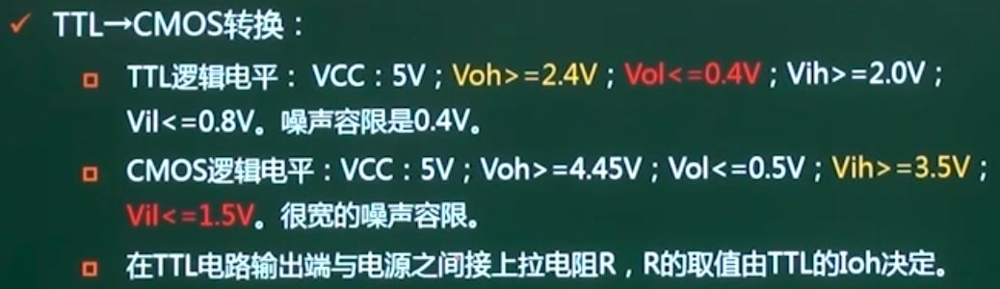

## 第10章 数字电路基础

### 1. 电子电路

电子电路分为两大类：

* 模拟电子电路
* 数字电子电路

模拟电子电路中，数值的度量采用直流电压或电流的连续值，称为模拟量

* 特点：数值由连续量来表示，其运算过程也是连续的

数字电子电路中，数值的度量采用数字量，它通常用0或1组成一串二进制数组成

* 特点：数值为离散量，运算结果也为离散量

数字量在数据精度、传输效率、可靠性指标等方面均比模拟量高，而且在数据存储方面比模拟量具有更大优势，因此在现代电子技术中数字系统得到了最广泛的应用。

#### 1.1 二进制系统

逻辑体制，通常未加说明，则为正逻辑体制

* 正逻辑体制规定高电平未逻辑1，低电平未逻辑0
* 负逻辑体制则相反。

### 2. 组合逻辑电路

根据电路是否具有存储功能，将逻辑电路分为两种类型：

* 组合逻辑电路
* 时序逻辑电路

组合逻辑电路不含存储功能，它的输出值仅取决于当前的输入值，与电路原来状态无关。

* 常用组合逻辑电路：译码器、多路选择器等

时序逻辑电路含有存储功能，它的输出值不仅取决于当前输入状态，还取决于存储单元中的值

* 常用的时序逻辑电路：寄存器、计数器等

#### 2.1 组合逻辑表示方法

==真值表==

==布尔代数==

* 与：AND，记为“ * ”，也称为逻辑乘
* 或：OR，记为“ + ”，也称为逻辑和
* 非：NOT，记为$\overline{A}$，也称为逻辑反

常用布尔代数定律：

> 注意最后的反演律

#### 2.2 组合逻辑电路构成

与非门NAND和或非门NOR这两个门电路可以利用非非律或者摩根绿组成任何组合逻辑，所以称为全能门电路。

#### 2.3 常用组合逻辑电路

##### 2.3.1 译码器

又称为解码器，将有特定含义的二进制码转换成对应的输出信号，与译码器对应的是编码器，是译码器的逆过程。每输入一个n位的二进制代码，在m个输出端中最多有一个有效。

译码器的输入端和输出端之间应满足：$m\leq 2^n$

* 当$m=2^n$时，称为全译码
* 当$m<2^n$时，称为部分译码

根据逻辑功能不同，译码器可分为两类：

* 通用译码器：二进制译码器、二-十进制译码器
* 显示译码器

##### 2.3.2 显示译码器

字符显示电路通常由译码驱动器和显示器等部分组成。

常用字符显示器有：发光二极管LED显示器、液晶LCD字符显示器、荧光显示器、气体放电管显示器。

 ##### 2.3.3 数据选择器（MUX）

* 数据选择器：又称为多路开关，是以“与或”门或“与或非”门为主的电路，作用相当于多个输入的单刀多掷开关
* 可以在选择信号的作用下，从多个输入通道中选择一个通道的数据作为输出
* 常见的数据选择器有：二选一、四选一、八选一、十六选一等
* 数据选择器还可以实现任意组合逻辑函数
* 多路选择器通过设置使能端，扩展数据选择器通路数，实现更多路的选择。

##### 2.3.4 数据分配器（DMUX）

又称为多路分配器，有一个输入端和多个输出端，将输入端的信号送至多个输出端中的某一个。

##### 2.3.5 多路开关

### 3. 时序逻辑电路

* I：时序电路的输入信号
* O：时序电路的输出信号
* E：驱动存储电路转换位下一状态的激励信号
* S：存储电路的状态信号，也成为状态变量，表示时序电路当前的状态，简称现态。

##### 3.1 时钟信号

 ##### 3.2 触发器（Flip-Flops）

* 能够存储1位二值信号的基本单元电路统称为触发器
* 触发器的基本特点：
  * 具有两个能自行保持的稳定状态表示逻辑状态的0和1
  * 根据不同的输入信号可以智诚1或0的状态
* 按时钟控制方式分为：电平触发、边沿触发、主从触发等方式
* 按逻辑功能分为：D型、JK型、RS型等

##### 3.3 电平触发器

* CP为约定“1”电平时，触发器接受输入数据，此时输入数据D在输出Q端得到反映；

* CP为非约定电平时，触发器状态保持不变
* 下图为锁定触发器（又称为锁存器）的逻辑图

* 在CP为高电平期间，输入信号发生多次变化，触发器也会发生相应的多次翻转，如下图所示：

* 在CP为高电平期间，因输入信号变化而引起触发器状态变化多于一次的现象，称为触发器的空翻
* 电平触发其结构简单，常用来组成==暂存器==

##### 3.4 边沿触发器

* 在时钟脉冲CP的约定边沿跳变（上升沿或下降沿），触发其接受数据
* 在CP=1、CP=0及非约定跳变时，触发其不接受数据

* 电平触发器在CP=1期间来到的数据立刻被接受，边沿触发器在CP=1期间来到的数据必须“延迟”到该CP=1过后的下一个CP边沿来到时才能被接受，故边沿触发器又被称为==延迟型触发器==。
* 边沿触发器的状态仅取决于CP信号的上升或下降沿到达时的输入的逻辑状态，即在CP边沿以外期间出现在D端的数据和干扰不会被接受
* 边沿触发器具有很强的抗数据端干扰的能力，常用来组成==寄存器、计数器==等。

##### 3.5 寄存器

* 寄存器：存储二进制代码
* 通常采用并行输入-并行输出的方式
* 主要组成部分：触发器，还有门电路构成的控制电路，以保证信息的正确接受、发送和清除
* 一个触发器能存储1位二进制代码，存储n位二进制代码的寄存器需要用n个触发器组成。

##### 3.6 移位寄存器

移位寄存器既能寄存数码，又能在时钟信号的控制下使得数码向高位或低位移动的逻辑功能部件。

* 按信息移动方向分
  * 单向移位寄存器：左移位寄存器、右移位寄存器
  * 双向移位寄存器
* 按信息的输入/输出方式分
  * 串行输入-串行输出
  * 串行输入-并行输出 （串并转换）
  * 并行输入-串行输出（并串转换）
  * 并行输入-并行输出

##### 3.7 计数器

由触发器和逻辑门组成，对输入时钟脉冲进行计数，也可用于分频、定时、产生节拍脉冲和脉冲序列及进行数字运算等。

* 按脉冲输入方式分
  * 同步计数器
  * 异步计数器
* 按计数基数分
  * 二进制计数器
  * 十进制计数器
  * 任意进制计数器
* 按逻辑功能分
  * 加法计数器
  * 减法计数器
  * 可逆计数器

异步计数器：

> 矩形+三角表示RS触发器

同步计数器：

* 各级触发器的时钟脉冲均来自同一个计数输入脉冲，各级触发器在计数脉冲作用下同时翻转（即并行进位），又称为并行计数器。
* 同步计数器需要将计数脉冲同时送到各级触发器的PC端，故要求产生计数脉冲电路具有较大的负载能力

* 优点：时钟CP同时触发计算器中的全部触发器，工作速度快，工作效率高
* 缺点：电路结构复杂

计数器运行时，经历的状态是周期性的，是在有限个状态中循环，通常将以此循环所包含的状态总数，称为计数器的”模“，也称为进位模

* N位二进制计数器的进位基数为$2^n$，也称为模$2^n$计数器

* 计数器中能计到的最大数称为==计数长度或计数容量==，n位二进制计数器的计数容量为$2^n-1$

* 环形计数器
  * 进位模数和触发器级数相等
  * 状态利用率不高
* 扭环形计数器
  * 进位模数是触发器级数的2倍

### 4. 电平转换电路

#### 4.1 数字集成电路的分类

金属氧化物半导体集成电路比双极型集成电路速度慢但功耗更低。

#### 4.2 双极型集成电路 - TTL\DTL\HTL

* 晶体管-晶体管逻辑电路（TTL）
  * TTL电路是==电流控制器件==
  * 开关速度快（ns）、较强的抗干扰能力
  * 足够大的输出幅度，带负载的能力较强，功耗大（mA级别）
  * 不用端多数不用处理
  * 应用最为广泛
* 二极管-三极管逻辑电路（DTL）
  * 工作速度较低
  * 已被TTL电路取代
* 高阈值逻辑电路（HTL）
  * 阈值电压较高，噪声容限较大，抗干扰能力较强
  * 工作速度比较慢
  * 几乎完全被CMOS电路取代

> 懒了

#### 4.3 MOS集成电路-PMOS/NMOS

* 按照所用MOS管类型不同，可分为
  * MOS集成电路：PMOS集成电路、NMOS集成电路
  * CMOS集成电路：由PMOS管和NMOS管构成的互补MOS集成电路
* PMOS集成电路
  * 速度低，现很少使用
* NMOS集成电路
  * 速度稍高，直流电源电压较低
  * 仍在使用

**CMOS集成电路**

#### 4.4 逻辑电平接口计数 - TTL->CMOS转换

#### 4.5 逻辑电平接口计数 - CMOS->TTL转换

### 5. 语音编码

* 声音三要素
  * 音调：决定声波的频率，频率高，则音调高，人的听觉范围为 20Hz ~ 20KHz
  * 音强：又称响度，决定于声波的振幅
  * 音色：决定于声波的形状
* 奈奎斯特采样定理：对于上限频率为Fh的带限信号，如果用Fs >= 2Fh的信号对它进行取样，则原信号将被所得到的取样值完全确定。

* 量化：采样时测的模拟电压值，需要进行分级量化，方式是按整个电压变化的最大幅值划分为几个区段，把落在某区段的采样到的样品值归成一类，并给出相应的量化值。

