## 第11章 嵌入式微处理器基础

> 重要

### 1. 嵌入式微处理器的结构与类型

#### 1.1 嵌入式微处理器的基本结构

嵌入式硬件系统一般由嵌入式微处理器、存储器和输入/输出部分组成

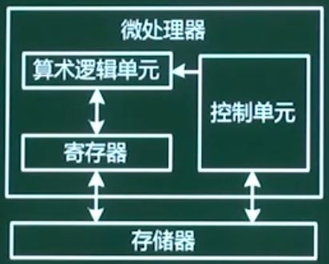

嵌入式微处理器是嵌入式硬件系统的核心，通常由以下3大部分组成：

* 控制单元：主要负责取指、译码和取数等基本操作并发送主要的控制指令，包括两个重要的寄存器：程序计数器PC、指令寄存器
* 算术逻辑单元：主要处理数值型数据和进行逻辑运算工作。
* 寄存器：暂存临时性的数据

#### 1.2 嵌入式微处理器的分类

* 嵌入式为控制MCU（Micro Controller Unit）：又称为单片机，片上外设资源一般比较丰富，适合于控制，可靠性强
* 嵌入式微处理器EMPU（Embedded Micro Processing Unit）:又称为==单板机==，由通用计算机中的CPU发展而来，仅保留和嵌入式应用紧密相连的功能硬件，可靠性较单片机弱。
* 嵌入式DSP处理器：专门用于信号处理方面的处理器，**哈佛结构**

* 嵌入式片上系统SOC：追求产品系统最大包容的集成器件，IP核，固化了嵌入式操作系统。

### 2. 嵌入式微处理器的体系结构

#### 2.1 冯.诺依曼与哈佛体系结构

**冯.诺依曼结构**：也称为普林斯顿结构，是一种将程序指令存储器和数据存储器合并在一起的存储器结构（**指令和数据保存在一块**）

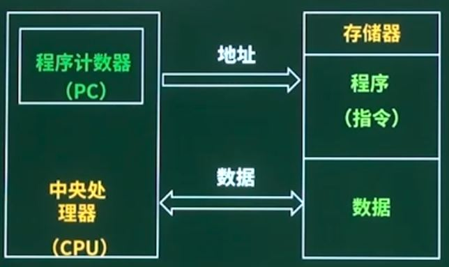

* 程序计数器PC是CPU内部指示指令和数据存储位置的寄存器
* CPU通过程序计数器提供的地址信息，对存储器进行寻址，找到需要的指令或数据，然后对指令进行译码，最后执行指令规定的操作。

* 特点：

  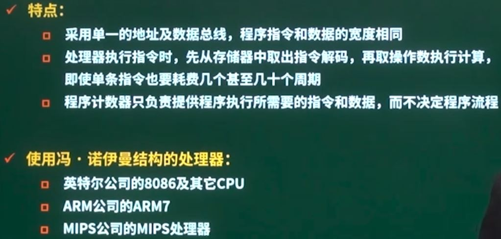

**哈佛体系结构**：是一种将程序指令存储和数据存储分开的存储器结构

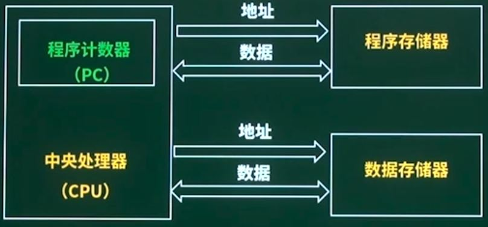

* 特点：

  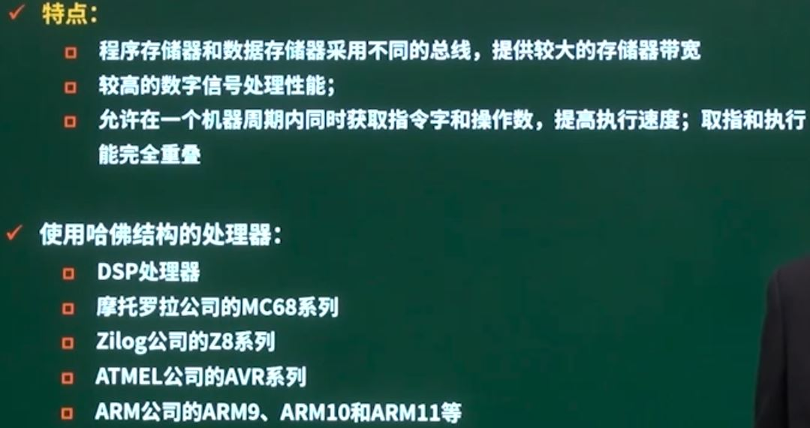

#### 2.2 Flynn分类法

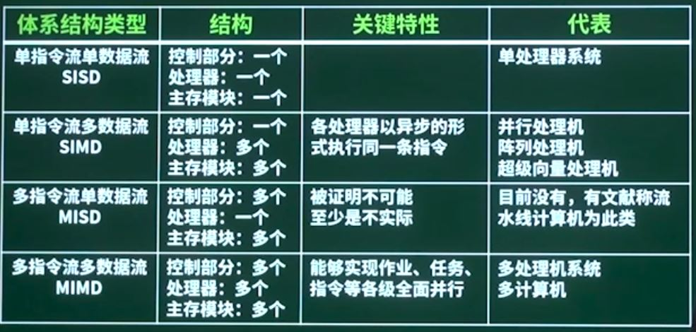

#### 2.3 CISC与RISC

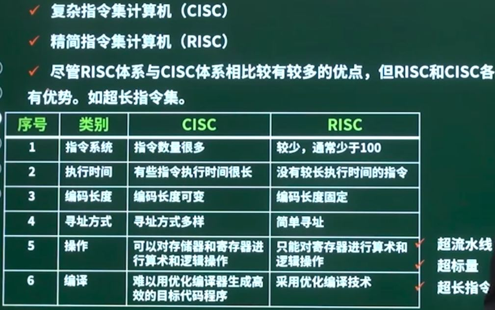

### 3. 常用嵌入式微处理器介绍

#### 3.1 8位微处理器

是指使用8位数据总线的微处理器

* 8位处理器是指用8位数据总线的微处理器，大部分8位微处理器有16位地址总线
* CISC，哈佛架构
* 具有低成本、可靠性高、可扩充内存以及接口设备等特点
* 功能、性能和片上资源相对于16位/32位/64位嵌入式微控制器来讲也教简单

常见型号包括：

* Intel的MCS-51系列
* Fairchild及Mostek公司的3870系列

##### 3.1.1 MCS-51硬件结构

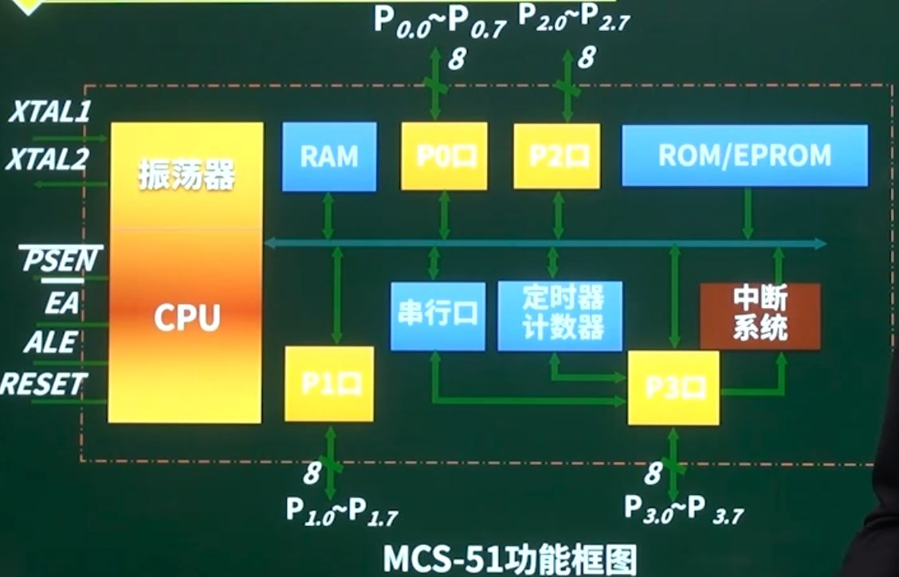

RAM：随机存储器，保存数据，片内一般为256KB，片外为64KB（16位总线）。

ROM：只读存储器，保存程序，片内4KB。

##### 3.1.2 MCS-51引脚说明

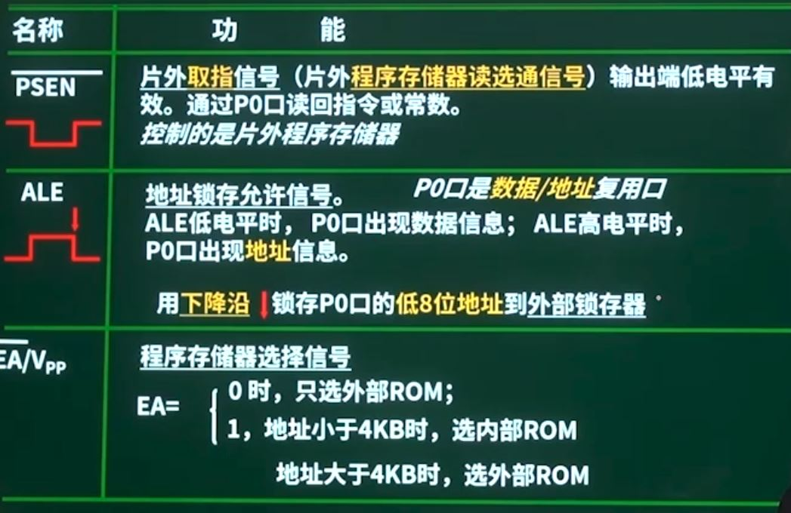

##### 3.1.3 MCS-51时钟电路

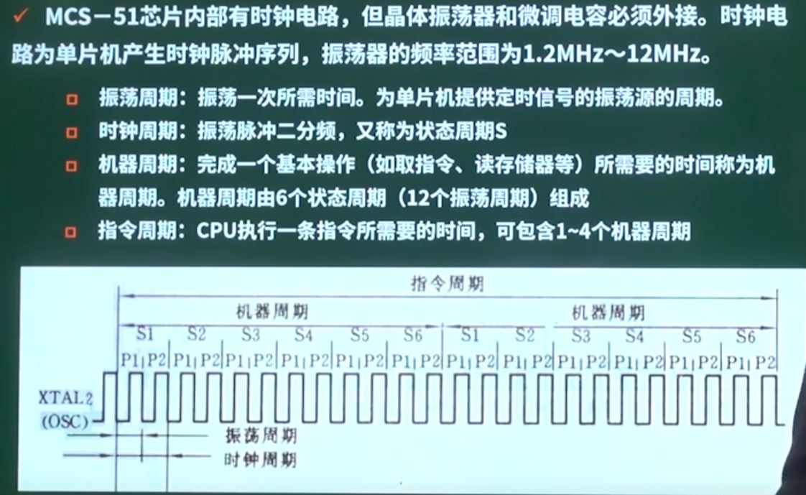

> 时钟周期：两次震荡周期

**时钟电路方式**：

* 内时钟方式：在XTAL1、XTAL2上外接定时原件，使其形成自激振荡器。定时原件采用由石英晶体和电容组成的并联谐振电路。

  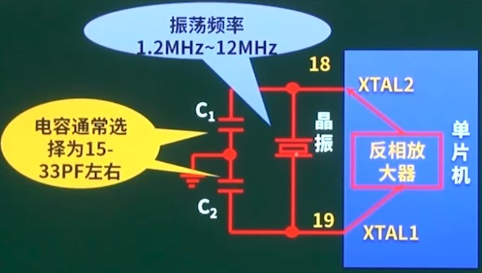

* 外时钟方式：XTAL2接地，XTAL1接外部振荡器

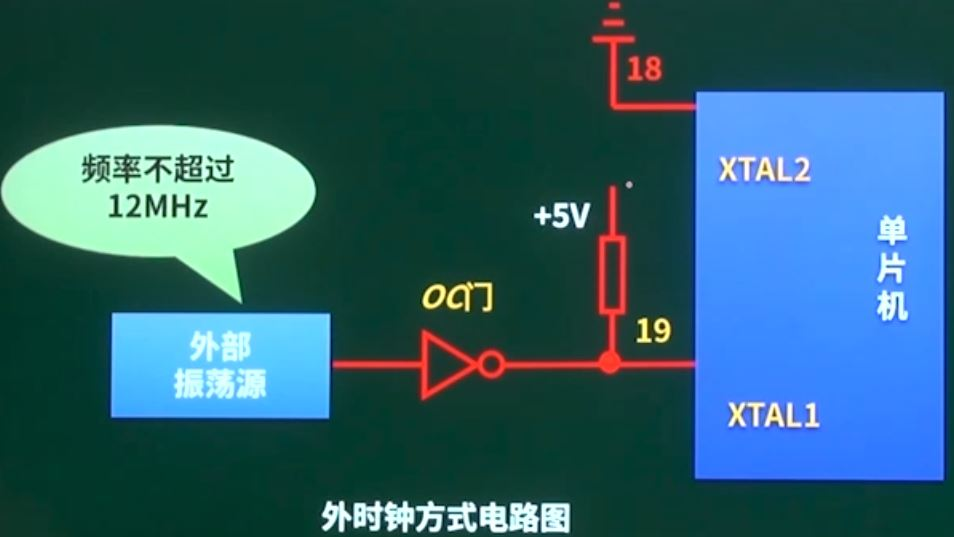

一个系统中存在多个单片机时使用，同步不同单片机的时钟信号。

##### 3.1.4 中断系统

中断：CPU执行程序过程，随机接受到外设发来的中断请求，CPU可暂时中断当前正在执行的程序，转到相应的中断服务（子）程序进行处理（中断相应和中断服务），处理完毕，再返回到原来的程序（被中断之处，即断点）（中断返回），继续运行下，这个过程称为中断。

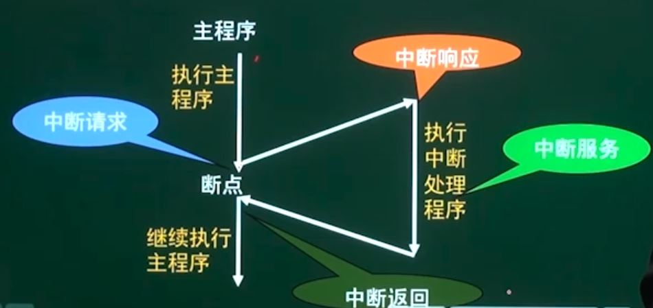

请求CPU中断的设备或事件称为中断源，根据中断源的不同类别，可以把中断分为**外中断**和**内中断**。

**中断的处理过程**：

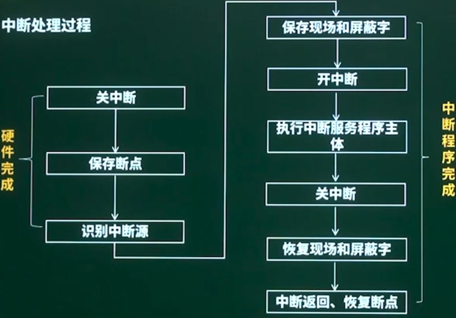

保存断点：保存程序计数器PC的内容，由硬件自动完成，==与操作系统无关==，中断系统对断点的保存都是在中断周期内由中断隐指令实现，对用户是透明的，**断点可以保存在堆栈中，由于堆栈先进后出的特点，可以依次将程序的断点压入堆栈中。**

开中断：为了支持嵌套中断。

**中断识别**：

CPU相应中断后，只知道有中断请求，但不知道是哪一个中断源，寻找中断源的操作过程称为中断识别。

中断识别的目的：形成该服务程序的入口地址。

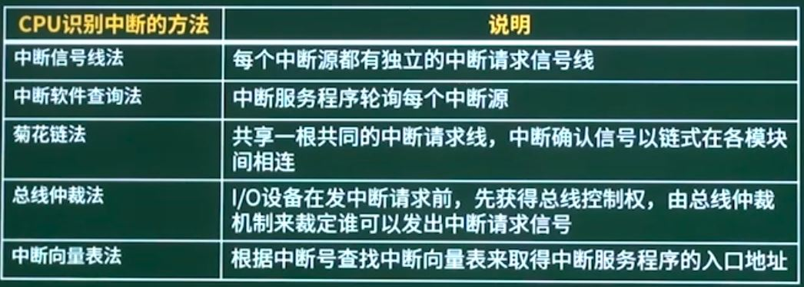

#### 3.2 16位微处理器

内部总线宽度位16位的微处理器

* 比8位微处理器有较大提高，数据宽度增加一倍，实时处理能力更强，主频更高，集成度、RAM、ROM有较大增加，更多的中断源，多路A/D转换通道等。
* MCS-96、196系列、68H2系列等。

MSP430系列单片机特点：

* 16位RISC CPU，**冯.诺依曼架构**

##### 3.2.1 MSP430硬件结构

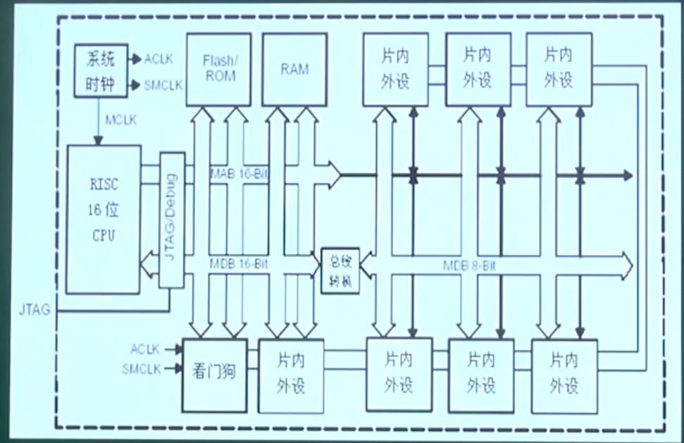

##### 3.2.2 JTAG口

* JTAG的接口是一种特殊的4/5个管教
  * TDI：测试数据输入
  * TDO：测试数据输出
  * TCK：测试时钟
  * TMS：测试模式选择
  * TRST：测试复位，可选
* JTAG主要应用于：电路的边界扫描**测试**和可编程芯片的在线系统编程、**调试**
  * 含有JTAG Debug接口模块的CPU，只要时钟正常，就可以通过JTAG接口访问CPU的内部寄存器和挂在CPU总线上的设备，如FALSH，RAM，Timers等。

#### 3.3 32位微处理器

采用32位地址和数据总线，其地址空间达到了4G

主流的32位嵌入式微处理器系列：

* ARM
* MIPS
* POWER PC
* X86
* SH系列

##### 3.3.1 ARM处理器

* RISC体系结构
* 每个数据处理指令中，都控制算法逻辑单元ALU和移位器
* 自动递增和自动寻址模式
* Load-Store体系结构，指令只能把内部寄存和立即数作为操作数，只有加载/存储（Load-Store）指令才可以访问内存。
* 所有指令都可以条件执行

**ARM的数据类型**：

* 字节（Byte）：8bits
* 半字（Half-word）:16bits
* 字（word）：32bits

##### 3.3.2 ARM处理的工作模式

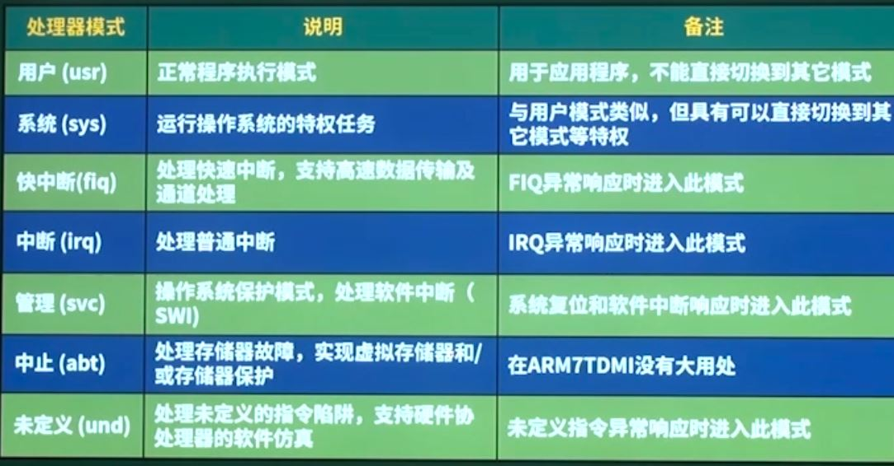

工作模式分为三类：用户模式、系统模式和异常模式，其中异常模式又可以分为5种。

##### 3.3.3 ARM处理器存储格式

* 大端格式

​	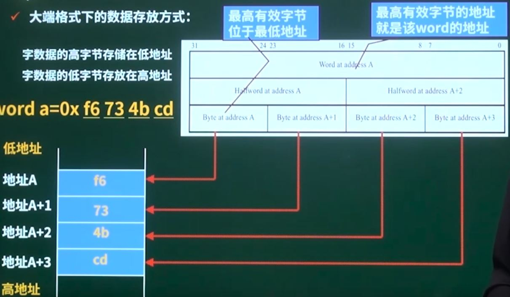

* 小端格式

​	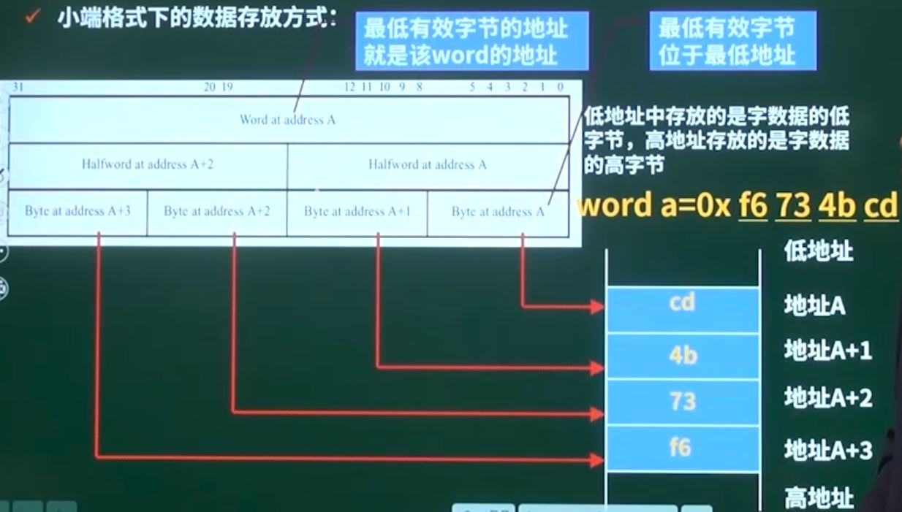

##### 3.3.4 I/O端口的编制方法

* I/O端口的编址方法：I/O端口的地址安排方式
  * 存储器映射编址：I/O端口的地址和内存地址连续
  * I/O映射编址：存储器和I/O地址相互独立

* 存储器映射编址方式和I/O映射编址方式比较

​	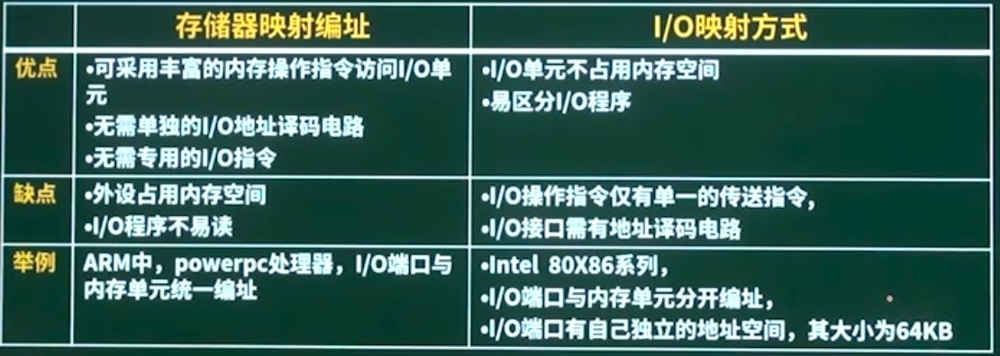

#### 3.4 DSP处理器

DSP处理器：专门为数字信号处理而设计的处理器，快速实现各种数字信号处理算法

* 多总线结构，运行CPU同时进行指令和数据的访问，因而可实现流水线操作
* **哈佛体系结构**，程序和数据空间分开，可以同时访问指令和数据
* 数字信号处理的运算特点：乘/加，及反复相乘求和，DSP设置了硬件乘法/累加器，能在单个指令周期内完成乘法/加法运算。

DSP主要应用：信号处理、图像处理、仪器、语音处理、控制、军事、通讯、医疗、家用电器等领域。

#### 3.5 多核处理器

双核处理器：基于单个半导体的一个处理器上拥有2个处理器核心

* 由于将2个或多个运算核封装在一个芯片上，节省了大量晶体管、封装成本
* 显著提高处理器性能
* 兼容性好
* 系统设计方便

软件角度：2个或多个内核工作协调实现方式（多核处理器运算模式）：

==考点：==

* **对称多处理技术（Symmetric multiprocessing，SMP）**：将2颗完全一样的处理器封装在一个芯片内，多个内核由一个操作系统管理，达到双倍或接近双倍的处理性能，节省运算资源，如Power4
* **非对称多处理器（Asymmetric Multiprocessing，AMP）**：2个处理内核彼此不同，每一个内核由一个操作系统管理，各自处理和执行特定的功能，在软件的协调下分担不同的计算任务，如OMAP5810
* BMP

> 选用哪种结构和硬件组成有关系

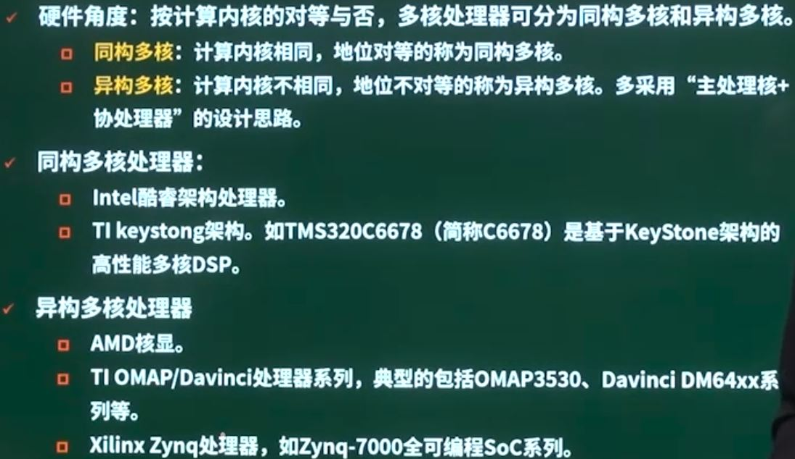

