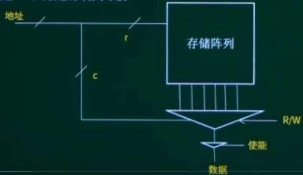
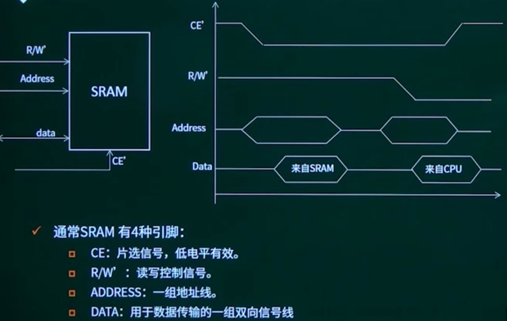
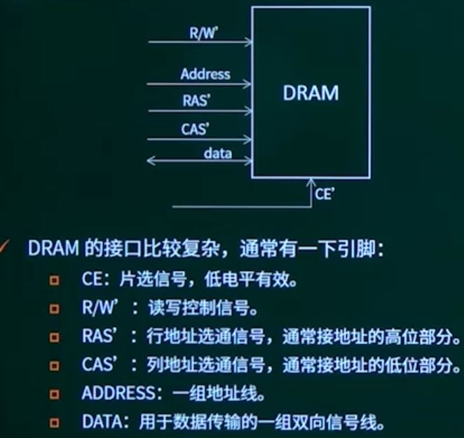

## 第12章 嵌入式系统的存储体系

### 1. 存储器部件的分类

按在系统中的地位分类

* 主存储器（内存）
* 辅助存储器（外存）

内存通常用来容纳当前正在使用的或要经常使用的程序和数据，CPU可以直接对内存进行访问。更多的系统软件和全部应用软件则在用到时由外村传送到内存。

按存储介质分类

* 磁存储器
* 半导体存储器
* 光存储器
* 激光存储器

按信息存取方式分类：

* 随机存取存储器
* 只读存储器

### 2. 存储器的组织和结构

存储器的参数：容量、数据宽度

存储器的容量是描述存储器最基本参数，如4MB，存储器的表示不唯一，不同表示方式有不同的数据宽度。

在存储器内部，数据是存放在二维阵列存储单元种

* 阵列以二维的形式存储，给出的n位地址被分为行地址和列地址，r是行地址数，c是列地址数
* 行列选定一个特定的存储单元。

### 3. 常见的嵌入式系统存储设备

#### 3.1 RAW（随机存储器）

RAW可以被读和写，地址可以以任意次序被读。

常见RAM的种类：

* SRAM：Static RAW，静态随机存储器
* DRAM：Dynamic RAW，动态随机存储器

SRAM比DRAM运行速度快，SRAM比DRAM耗电多，DRAM需要周期性刷新。

#### 3.2 ROM（只读存储器）

ROM在烧入数据后，无需加外电源来保存数据，断电后数据不丢失，但速度较慢。

常见的ROM有：

* Mask ROM（掩膜ROM）：一次性由厂家写入数据的ROM。
* PROM（Promgammable ROM，可编程ROM）：出厂时厂家没有写入数据，其内容全为0或全为1，由用户来编程一次性写入数据。
* EPROM（Erasable Programmable ROM，可擦写ROM）：可以通过紫外光的照射，擦掉原先的程序，芯片可重复擦除和写入，写入时间较长。
* EEPROM（电可擦除可编程ROM，也称为E2PROM）：通过加点擦除原编程数据，通过高压脉冲写入数据。
* ==Flash ROM==（闪速存储器）：断电不会丢失数据，快速读取，电可擦除可编程。

#### 3.3 Flash的种类

* Flash memory（闪速存储器）是嵌入式系统重要组成部分，用来存储程序和数据，掉电后数据不会丢失。
* Flash memory是一种非易失性存储器NVM（Non-Nolatile memory）,根据结构不同分为：**NOR Flash**、**NAND Flash**。

**NOR Flash**和**NAND Flash**

共同特点：

* 区块结构，Flash Memory在物理结构上分为若干区块，区块之间相互独立。

  * NOR Flash把整个存储区分为若干个扇区（Sector）

  * NAND Flash把整个存储区分为若干块（Block）

  * 可以对以块或扇区为单位的内存单元进行**先擦写和再编程**。

  * Flash Memory的写操作只能将数据位从1写成0，擦操作的最小单位是一个区块，而不是单个字节。

  * 操作指令：除了NOR Flash的读，Flash Memory的其他操作不能像RAM那样，直接对目标地址进行总线操作。

* 位反转：所有Flash Memory器件存在位交换现象，在读写数据时，偶然会产生一位或几位数据错误，即==位反转==。

* 坏块：Flash Memory在使用过程种，可能导致某个区块的损坏，一旦损坏则无法修复。

不同特点：

* 应用程序可以直接在NOR Flash内运行（**NAND Flash不行**），不需要再把代码读到系统RAM中。
* NOR Flash的传输效率很高，在1~4MB的小容量时具有很高的成本效益，但是其写入和擦除速度很慢。
* NAND Flash的结构可以到达高存储密度，写入和擦除的速度很快，应用NAND Flash的困难在于==需要特殊的系统接口==。

性能比较：

* NAND Flash的擦写操作十分简单，其擦写以8~32KB块进行，执行一个写入\擦除操作的时间是4ms。
* NOR Flash则要求在进行**擦除前先将目标块所有位写为0**，且其是以64~128KB单位块进行，执行一个写入\擦除操作的时间是5s。
* NOR Flash的读写速度比NAND Flash稍快。
* NAND Flash的写入速度比NOR Flash快很多。
* NAND Flash的随机读取能力差，适合大量数据的连续读取，类似于硬盘。

市场定位：

* NOR Flash：代码闪存
* NAND Flash：数据闪存

#### 3.4 RAM的种类

* SRAM：静态随机存储器，速度比DRAM运行速度快，但成本高
* DRAM：动态随机存储器，需要周期性刷新。
* DDRAM：Double Data Rate SDRAM，双倍速率随机存储器，是SDRAM的下一代产品，本质与SDRAM相同。
  * SDRAM：同步动态随机存储器。

**SRAM特点：**

* 集成度低，速度较高，常用于高速缓冲存储器。
* 引脚图：

​		

**DRAM特点：**

* 以电荷的形式进行存储

* 必须定时刷新，因此DRAM在使用时必须配合DRAM控制器。

  CPU  <=> DRAM控制器  <=> DRAM

* 引脚图

  

**SDRAM的特点**：

* 同步动态随机存储器，同步指内存工作需要同步时钟，内部的命令发送与数据的传输都以它为基准
* 动态是指需要不断刷新
* 通常只能在133MHz的主频，
* SDRAM可读可写，不能掉电保存，但存取速度大大高于Flash存储器。

**DDRAM**：

* 表示双倍速率同步随机存取存储器，也称为DDR
* 基于SDRAM技术
* 双倍预取技术，即内存芯片内部的数据宽度是外部接口数据宽度的2倍，使峰值的读写速度达到输入时钟速率的2倍
* 允许在时钟脉冲的上升沿和下降沿均传输数据
* 差分输入方式
* 在133MHz的主频下，DDR内存带宽可以达到133x64b/8x2=2.1GB/s

#### 3.5 外部存储器

硬盘、光盘、标准存储卡、安全数据卡

