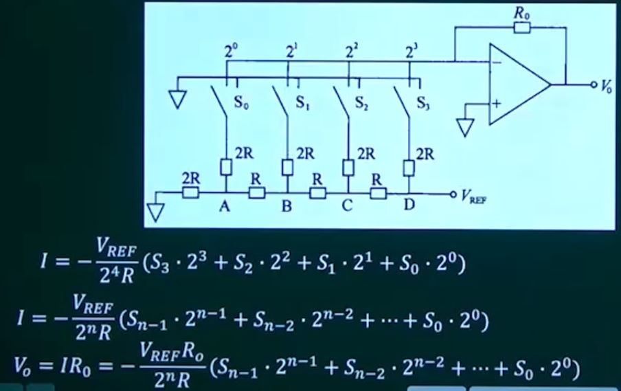

## 第13章 嵌入式系统输入输出设备

### 1. GPIO原理与结构

GPIO（General Purpose I/O，通用输入、输出接口）也称为并行I/O，是最基本的I/O形式。

* 由一组输入引脚或输出引脚组成，CPU对它们能够进行存取操作。
* 有些GPIO引脚能够通过软件编程改变输入/输出方向。

一个双向GPIO端口由两部分组成：

* PORT：数据寄存器
* DDR（Data Direction Register）：数据方向寄存器

### 2. A/D接口原理与结构

A/D转换器是把电模拟量转换为数字量的电路，实现A/D转换的方法有很多，常用的方法有

* 计数法：主要部件包括比较器、计数器、D/A转换器
* 双积分法：积分器、比较器、计数器和标准电压源
* 逐次逼近法：比较器、D/A转换器、逐次逼近寄存器和基准电压源

### 3. D/A接口原理与结构

#### 3.1 概述

把输入的数字量转换为与输入量成比例的模拟信号，简称为DAC，Digital to Analog Converter。

* 在集成化的D/A转换器中，通常采用电阻网络实现将数字量转换为模拟量
* 然后再用运算放大器完成模拟电流到模拟电压的转换

#### 3.2 D/A转换器的工作原理

一个4位T型电阻网络DAC如图所示

* 电路由R-2R电阻解码网络、模拟电子开关和放大电路构成，因为R和2R组成了T型，故称为T型电阻网络DAC。

#### 3.3 D/A转换器的分类

电压输出型：

* 直接从电阻阵列输出电压，但一般采用内置输出放大器以低阻抗输出
* 仅用于高阻抗的负载，由于无输出放大器部分的延迟，故常作为高速D/A转换器使用。

电流输出型：

* 直接输出电流，应用中通常外接电流-电压转换电路得到电压输出。

乘算型：

* 略

#### 3.4 D/A转换器的指标

分辨率：

* DAC电路所能分辨的最小输出电压与满量程输出电压之比称为DAC的分辨率。
* 分辨率为 1/(2^n-1)，其中n表示数字量的二进制位数

DAC产生误差的主要原因：

* 基准电压的拨动
* 运放的零点漂移
* 电阻网络中电阻阻值偏差等

转换误差：

* 用满量程FSR（Full Scale Range）的百分数来表示
* 有时也用最低有效位LSB（Least Significant Bit）的倍数来表示

建立时间：

* 指输入数字量变化后，输出模拟量稳定到相应数值变化所需要的时间

精度：

* 绝对精度：以数字量的最小有效位的分数值来表示绝对精度，例如正负1LSB。
* 相对精度：指整个转换范围内，任一数字量所对应的模拟输入量的实际值和理论值之差，用模拟电压满量程的百分比表示。

量程

* 指所能转换的模拟输入电压范围，分单极性、双极性两种类型。

