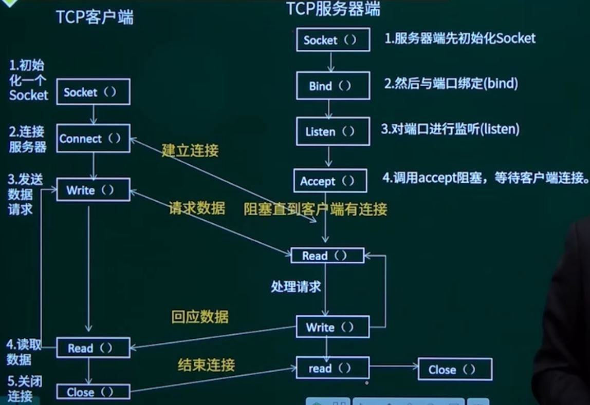

## 第14章 嵌入式系统总线&通信接口

### 1. 串行接口基本原理与结构

#### 1.1 串行通信

数据是一位一位进行传输，在传输中的每一位都占据一个固定的时间长度。成本低适合远距离传输，但速度慢。

通信模式：

* 单工
* 半双工
* 全双工

信息格式：

#### 1.1.1 异步通信

指通信的发送和接受设备使用各自的时钟，控制数据的发送和接受过程。为使双方的收发协调，要求发送和接受设备的时钟尽可能一致。

* 数据是一帧一帧传送的，每帧数据包含有**起始位**、**数据位**、**奇偶校验位**和**停止位**，每帧数据的传送靠起始位来同步。
* 一帧数据的各位代码间的时间间隔是固定的，而相邻两帧的时间间隔是不定的。
* 在异步通信的数传送中，传输线上运行空字符。

**字符格式：**

* 每个字符传送时，必须前面加一起始位，后面加1、1.5或2位停止位。

**波特率**：传送数据位的速率称为波特率，用位/秒(bit/s)来表示。

**校验位**：偶校验就是要使字符加上校验位有偶数个“1”。

异步通信特点：

* 不要求收发双方时钟严格一致，实现容易，设备开销小。
* 传输效率不高，有效数据的实际使用量只有约80%

##### 1.1.2 同步通信

* 一种比特同步通信计数，要求收发双方具有同频同相的同步时钟信号，需要在传送报文的最前面附加**特定的同步字符**，使收发双方建立同步，此后便在同步时钟的控制下逐位发送/接受。
* 采用字符块的方式，减少每一个字符的控制和错误检测数据位，具有较高的传输速率。
* 将许多字符具有成一个字符块后，在每块信息之前要加上1~2个同步字符，字符块之后再加上适当的错误检测数才传送出去。 

#### 1.2 RS-232C串行接口（重要）

串行通信接口标准。RS-232C通常以正负12V的电压来驱动信号线，TTL标准（计算机内部标准）与RS-232C标准之间的电平转换电路通常采用集成电路芯片实现。

RS-232C接口信号：

* RS-232C接口与外界相连采用25芯（DB-25）和9芯（DB-9）D型插接件，实际应用中，并不是每只引脚信号都必须用到。

* 连接方式：
  * 简单连接：只连接发送数据线、接收数据线和信号地，实现**全双工通信**。
  * 完全连接
  * 传输距离：15m左右，速率：20Kbit/s
  * 只能支持点对点传输

#### 1.3 RS-422串行通信接口

RS-232的改进型，是一种单机发送、多机接受的单向、平衡传输规范，传输速率可达10Mb/s，采用==差分传输方式（单向两条线，共需四条线通信）==，也称为平衡传输。

* 运行相同传输线上连接多个接收节点，最多可接10个节点（从设备），从设备之间不可通信。
* 传输距离：4000英尺（1219m），最大传输速率10Mb/s

#### 1.4 RS-485串行总线接口

在RS-422基础上，为扩展应用范围提出，增加了多点、双向通信能力。可以采用二线或四线。

* 二线制可实现真正多点双向通信（半双工）
* 四线时和422一样，只能实现点对多通信，即只能由一个主设备，其余为从设备。

### 2. 并行接口基本原理与结构

并行通信是将数据字节的各位用多条数据线同时进行传送，一般用来连接打印机、扫描仪等。

并行接口分类：

* SPP（标准并口）
* EPP（增强型并口）
* ECP（扩展型并口）

并行总线分为：

* 标准并行总线：IEEE488总线和SCSI总线
* 非标准并行总线：MXI总线

#### 2.1 IEEE488总线

* 也称为GPIB（General Purpose Interface Bus，通用接口总线）
* 位并行、字节串行双向异步方式传输信号
* 总线方式连接，仪器设备并联于总线上，最多可以连接15台设备
* 最大传输距离20m，信号传输速度为500Kb/s，最大传输距离为1Mb/s
* 广泛应用于仪器、仪表、测控领域

#### 2.2 SCSI总线

* SCSI（Small Computer System Interface，小型计算机系统接口）总线
* 速度为5Mb/s，传输距离6m
* 普遍作为计算机的高速外设总线，如连接高速硬盘驱动器

#### 2.3 MXI总线

* Multi-system extension Interface bus，多系统扩展接口总线，一种高性能非标准的通用多用户并行总线
* 32位高速并行总线，最高速度为23Mb/s，传输距离20m
* 用作计算机与测控机箱的互联。

### 3. PCI接口基本原理与结构

PCI（Peripheral Component Interconnect，外围设备互连）总线，是当前用于系统扩展最流行的总线之一。

> 属于系统总线，非外围总线。
>
> 系统总线是计算机内部的总线，用于连接CPU、内存和其他主要组件。外部总线是计算机与外部设备通信的总线，例如USB、SATA和PCIe总线。

* PCI总线是地址、数据多路复用的高性能32位和64位总线，是微处理器与外围控制部件、外围附加板之间的互连机构，并行总线
* 定义了32位数据总线，并可扩展为64位，总线速度有33MHz和66MHz两种
  * 改良的PCI系统PCI-X，数据传输速度最高为64位@133MHz
  * PCI总线主板插槽的体积比ISA总线插槽小，支持突发读写操作（突发数据互传），可同时支持多组外围设备。
* 地址总线与数据总线是分时复用的，支持即插即用、中断共享
* PCI总线在数据传输时，由一个PCI设备做发起者，而另一个PCI设备做目标
  * 总线上所有时序的产生与控制都有Master发起
  * PCI总线在同一时刻只能供一对设备完成传输，要求有一个仲裁机构来决定谁有权拿到总线的主控权。

### 4. USB接口基本原理与结构

#### 4.1 USB总线的主要性能特定

USB（Universal Serial Bus，通用串行总线），用于连接计算机与外围设备的机外串行总线。

* 最多可以连接127个设备，支持多个设备同时操作。
* 支持热插拔
* 可同时支持不同同步传输（同步和异步）和速率的设备
* 统一采用4引脚插头和一根四芯的电缆传送信号和电源
* 支持低速、全速和高速

#### 4.2 物理接口

USB总线的电缆有一对标准尺寸的双绞线和一对标准尺寸的电源线，共4根导线。

### 5. SPI接口基本原理与结构

#### 5.1 SPI接口简介

SPI（Serial Peripheral Interface，串行外围设备接口），一个低成本、易使用的接口，主要用在微控制器和外围设备芯片之间的连接。

* SPI接口可以连接存储器、A/D转换器、实时时钟、LCD驱动器等

SPI是一个4线接口，主要使用4个信号：

* 主机输出/从机输入（MOSI）
* 主机输入/从机输出（MISO）
* 串行SCLK或SCK：时钟信号
* 外设片选（CS）

与标准的串行接口不同，SPI是一个同步协议接口，所有的传书都参照一个共同的时钟，这个同步时钟由主机产生，接受数据的外设使用时钟来对串行比特流的接受进行同步化。

#### 5.2 SPI接口基本原理

#### 5.3 SPI接口工作模式

根据时钟极性和时钟相位的不同，SPI有4种工作模式。

* 时钟极性有高电平、低电平两种
* 时钟相位有两个：时钟相位0和时钟相位1

时钟极性（CPOL: Clock Polarity）:

* 时钟极性为低电平时：空闲时时钟处于低电平，传输时跳转到高电平
* 时钟极性为高电平时：空闲时时钟处于高电平，传输时跳转到低电平

时钟相位（CPHA：Clock Phase）:

* 当CPHA为0时，时钟周期的前一边缘采集数据
* 当CPHA为1时，时钟周期的后一边缘采集数据

### 6. IIC接口基本原理与结构

IIC总线（Inter Integrated Circuit BUS，内部集成电路总线），二线制串行扩展总线，用于连接微控制器及其外围设备。

* 具有==总线仲裁==和高低速设备同步功能，多主机总线
* 直接用导线连接设备，通信时无需片选信号
* IIC总线的协议层包含物理层和数据链路层，物理层有两根信号线，==链路层每个连接到IIC总线的设备都有唯一的地址。==

#### 6.1 IIC总线的数据传送

IIC总线有4种操作模式：

* 主发送模式：主机发送
* 主接受模式：主机发送
* 从发送模式：CPU作为从机
* 从接受模式：CPU作为从机

**启动信号**：启动信号由主机产生，当SCL信号为高，SDA产生一个由高到低的电平变化时，即产生一个启动信号，此时总线被主器件占用，变成了“忙”状态。

**停止信号**：SCL信号为高，SDA产生一个由低变高的电平变化，产生停止信号，过几个时钟周期后，总线变成“闲”状态。

**读写数据**：主器件产生一个启动信号后，会立即送出一个从地址（1个字节），用来通知与之通信的从器件

* 1个字节的地址包括7位的地址信息和1位的传输方向指示位，若第7位为“0”，表示主机发送数据，进行写操作，若第7位为”1“，表示主机接受数据，进行读操作。

**数据传输格式**：SDA上传输的每个字节长度都是8位，每次传输字节数量无限制，启动信号后第一个字节为地址域，之后每个传输的字节后都有一个应答位（即一帧共有9位），传输中串行数据的MSB（字节的高位）首先发送。

#### 6.2 IIC总线工作原理

### 7. 网络接口基本原理与结构

#### 7.1 以太网接口基本原理与结构

##### 7.1.1 以太网基础知识

以太网是目前应用最广泛的局域网通讯方式，同时也是一种协议，以太网协议定义了一系列软件和硬件标准，从而将不同的设备连接在一起。

* 嵌入式系统通常使用的以太网协议是**IEEE802.3标准**
  * 以太网接口电路主要由媒质接入控制MAC控制器和物理层接口两大部分构成
* 在802.3版本标准中，没有直接采用二进制编码（0V表示0，5V表示1），而是采用
  * 曼彻斯特编码
  * 差分曼彻斯特编码
* 曼彻斯特编码：每位中间有个电平跳变，从高到低的跳变表示0，从低到高的跳变表示1。

* 差分曼彻斯特编码的规律：每位中间有个电平跳变，但不用这个跳变来表示数据，而是利用每个码元开始时有无跳变来表示”0“或”1“，有跳变表示0，无跳变表示1（保持性）。

**802.3MAC层的帧**：

| PR   | SD   | DA   | SA   | TYPE | DATA           | PAD  | FCS  |
| ---- | ---- | ---- | ---- | ---- | -------------- | ---- | ---- |
| 56位 | 8位  | 48位 | 48位 | 16位 | 不超过1500字节 | 可选 | 32位 |

* 通常PR、SD、PAD、FCS数据段是网卡（包括物理层和Mac层的处理）自动产生，剩下的DA、SA、TYPE、DATA 4个段的内容由上层软件控制。

**以太网数据传输的特点：**

* 所有数据位的传输由低位开始，传输的位流采用曼彻斯特编码
* 以太网是基于冲突检测的总线复用方法，冲突退避算法由硬件自动执行
* 以太网传输的数据段长度，DA+SA+TYPE+DATA+PAD==最小为60B，最大为1514B==
* 通常以太网卡可以接受3种地址的数据：广播地址、多播地址（或组播地址，嵌入式少见）、自己的地址。但有时，用于网络分析和监控，网卡也可以设置为接受任何数据包
* 任何两个网卡的地址都是不一样的，是世界唯一。

##### 7.1.2 嵌入式以太网接口的实现方法

嵌入式处理器+网卡芯片

* 通用性强，对嵌入式处理器没有特殊要求，但速度慢，可靠性不高，电路板走线复杂

带有以太网接口的嵌入式处理器

* 通常是面向网络应用而设计，速度快。

##### 7.1.3 网络编程接口

BSD套接字（BSD sockets）是使用最广泛的网络程序编程方法

* 主要用于应用程序的编写，用于网络上主机与主机之间的相互通信

套接字分为Stream Sockets和Data Sockets

* Steam Sockets是可靠的双向数据传输，对应使用TCP协议传输数据
* Data Sockets是不可靠连接，对应使用UDP协议传输数据。

#### 7.2 CAN总线接口基本原理与结构

CAN（Controller Area Network，控制器局域网）是德国Bosch公司为汽车应用开发的，是一种现场总线，能有效支持分布式控制和实时控制的串行通信网络。

CAN总线是一种==多主方式的串行通信总线==：

* 理想的CAN总线构成的单一网络种，是可以挂接任意多个节点，实际应用受网络硬件的电气特性所限制。
* CAN总线具有很高的实时性能。

CAN总线的通信介质可以采用双绞线、同轴电缆和光导纤维，最常用双绞线（网线）：

* CAN总线上任意节点可以在任意时刻主动向网络上其他节点发送信息而不分主次，因此各节点之间可以自由通信。
* 总线信号使用差分电压传送。

**嵌入式处理器上扩展CAN总线接口：**

* 面向工业控制的嵌入式处理器集成了一个或多个CAN总线控制器

  CAN总线控制器主要是完成时序逻辑转换工作，要在电气特性上满足CAN总线标准，还需要一个CAN总线的物理层芯片，用它来实现TTL电平到CAN总线电平特性的转换，即CAN收发器。

  

* 在嵌入式处理器上扩展CAM总线接口

​		大多数嵌入式处理器都有SPI总线控制器，MCP2510可以3v到5v供电，能够直接和3.3v I/O的嵌入式处理器连接，电路原理图如图所示：

#### 7.3 无线以太网（WLAN）基本原理与结构

WALN（Wireless Local Area Network，无线局域网）是利用无线通信技术在一定的局部范围内建立的，是计算机网络和无线通信技术相结合的产物，以无线多址通道作为传输媒介，提供有线局域网的功能。

传输介质

* 红外线IR
* 射频RF波段

WALN的标准：主要是针对物理层和媒质访问控制层（MAC层）

* 涉及所使用的无线频率范围、控制接口通信协议等技术规范和标准。

#### 7.4 1394接口基本原理与结构

IEEE1394是一种高品质、高传输速率的串行总线技术，1995年被IEEE认定为串行工业总线标准

* 1394作为一种标准总线，可以在不同工业设备之间架起一座沟通桥梁
* 一条总线可以接入63个设备
* 仅支持64位固定解址模式

特点：

* 支持多种总线速度
* 支持热插拔
* 有两种接口：6针六角形和4针四角形
* 支持同步和异步传输
* 支持点到点通信，是多主总线，每个设备均可以获取总线控制权。

IEEE1394协议由3层组成：物理层、链路层和事务层，另外还有一个管理层。

* 物理层和链路层由硬件构成，通常集成在同一块芯片上
* 事务层主要由软件实现。

物理层：提供给电气和机械连接，解析字节流并发送数据包给链路层

链路层：给事务层提供确认数据的服务，包括寻址、数据组帧和数据校验。

### 8. 总线分类

补充：SCSI属于外部总线。

常见的串行总线有：

SPI、IIC、USB、RS-232、CAN

并行总线有（并行总线种类较少）：

ISA、PCI、VME

新一代高速串行总线有：

SATA、PCIE、IEEE1394、RapidIO、USB3.0

RapidIO、PIC Express、Starfabric、InfiniBand等高性能的串行互连技术均采用交换式互连架构，代表了当今互连技术的发展趋势。

RapidIO技术是一种高性能、低引脚数、基于数据包交换的交叉开关互连技术，被定义为三层分级体系结构，分别为逻辑层、传输层和物理层，可以实现从1Gbps到60Gbps的通信速率。

