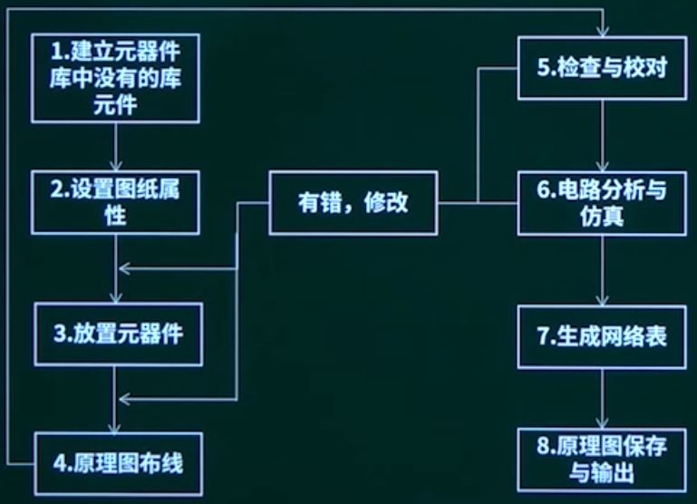
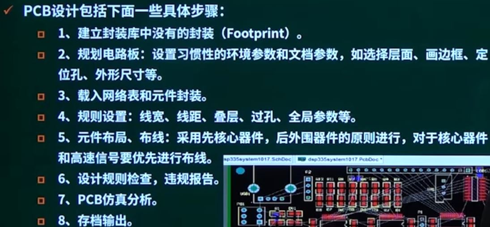
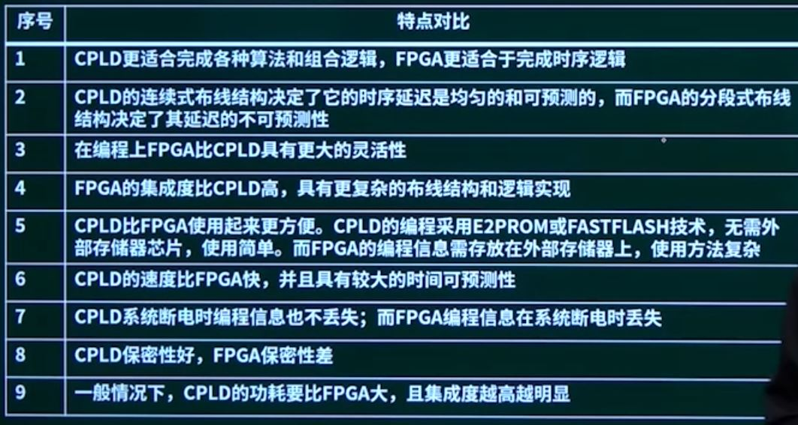
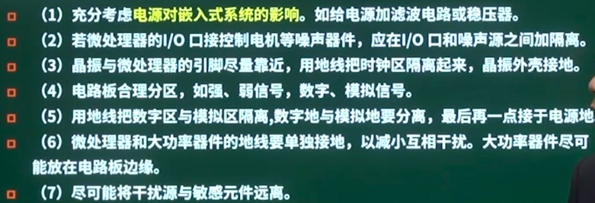
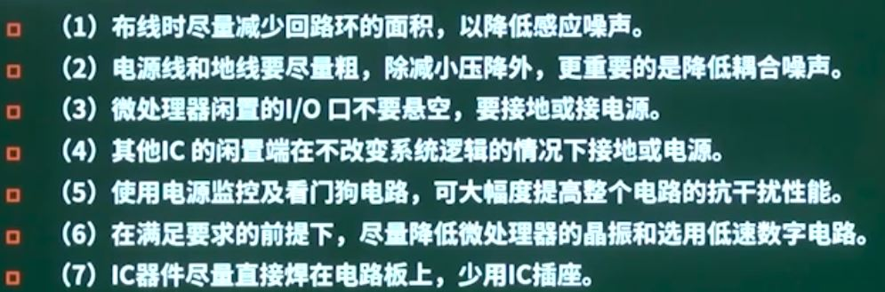

## 第15章 嵌入式硬件设计

### 1. 电路设计

电路板设计主要分为3个步骤：

* 设计电路原理图
* 生成网络表：网络表是电路原理设计和印制电路板设计中的一个桥梁，是设计工具软件自动布线的灵魂，网络表可以从原理图种生成，也可以从印制电路板中提取
  * 网络表包含2部分：元器件声明和网络定义
* 设计印制电路板

电路原理图设计不仅是整个电路设计的第一步，也是电路设计的基础，包括以下一些步骤：

### 2. PCB电路设计

#### 2.1 PCB设计方法

#### 2.2 多层PCB设计的注意事项

* 高频信号线一定要短，不可以有尖角，不宜平行或过近
* 双面板，一面的布线成横线，另一面的布线成竖线，尽量不要成斜线
* 注意线宽
* 屏蔽：铜膜线的底线应该在电路板周边，同时将电路上可以利用的空间都使用铜箔做底线，增强屏蔽能力，防止寄生电容
* 底线的共阻抗干扰
  * 布线时不能将具有地线符号的点随便连接在一起，这可能引起有害的耦合

#### 2.3 PCB设计中的可靠性设计

地线设计

* 正确选择单点接地与多点接地
* 将数字电路与模拟电路分开，两者地线不能向混，分别与电源端地线相连
* 尽量加粗地线
* 将接地线构成闭环路，可以明显提高抗噪声能力。

电磁兼容性设计

是指设备或系统在其电磁环境中符合要求运行并不对其环境中的任何设备产生无法忍受的电磁干扰能力

* 设备正常运行过程中对所在环境产生的电磁干扰不能超过一定阈值
* 设备对环境中存在的电磁干扰具有一定程度的抗扰度，即电磁敏感性

提高电磁兼容性可以如下

* 采用合理的导线宽度
* 采用正确的布线策略，最好采用井字形网状布线结构
* 抑制反射干扰
* 去耦电容配置

### 3. 电子设计

电子设计自动化（Electronic Design Automation，EDA）是指以计算机为工作平台，融合了应用电子技术、计算机技术、智能化技术最新成果而研制成的电子CAD通用软件包。

#### 3.1 EADA技术

电子系统设计自动化（Electronic System Design Automation，ESDA）

基本特征：

* 采用自顶向下的设计方法，对整个系统进行方案设计和功能划分
* 系统的关键电路用一片或几片专用集成电路（ASIC）实现
* 然后采用硬件描述语言HDL完成系统行为级设计
* 最后通过综合器和适配器生成最终的目标器件

#### 3.2 ASIC

ASIC按照设计方法的不同可以分为全定制ASIC、半定制ASIC和可编程ASIC（也称为可编程逻辑器件），可编程ASIC又可分为两类

* FPGA，现场可编程逻辑器件
* CPLD，复杂可编程逻辑器件

#### 3.3 HDL

硬件描述语言（Hardware Description Language，HDL）是一种用于硬件电子系统的计算机语言

* 用软件编程的方式来描述电子系统的逻辑功能、电路结构和连接形式
* 适合大规模系统的设计

VHDL（超高速集成电路硬件描述语言）：一种全方位的硬件描述语言，包括系统行为级、寄存器传输级和逻辑门多个设计层次，支持结构、数据流、行为3种描述形式的混合描述。

* 一个VHDL语言程序通常包含实体、结构体、库、包集合和配置五个部分组成

#### 3.4 系统级设计

系统级设计是“概念驱动式”设计，针对设计目标进行功能描述。系统级设计步骤：

* 按照自顶向下的设计方法进行系统划分
* 输入VHDL代码
* 编译成标准的VHDL文件
* 用综合器对VHDL源代码进行综合优化处理，生成门级描述的网络表文件
* 用适配器将网络表文件针对某一具体目标元件进行逻辑映射操作
  * 适配报告
  * 适配后的仿真模型
  * 元件编程文件
* 烧写到目标芯片FPGA或CPLD

### 4. 电子电路测试

电子电路测试相关基本概念：

* 故障检测
* 故障诊断（故障定位）
* 仿真
* 测试
* JTAG：JTAG测试接口是IC芯片测试方法的标准

测试方法：

* 内部测试：元器件进行检查
* 功能测试
  * 将被测IC芯片放到测试仪器上，测试设备根据需要产生一些列测试输入信号，加到被测元件上
* 边界扫描与JTAG
  * 边界扫描是常见的硬件测试方法

**硬件抗干扰措施**

* 切断干扰传播路径的常用措施

* 提高敏感元件的抗干扰性能

### 5. 下午题

