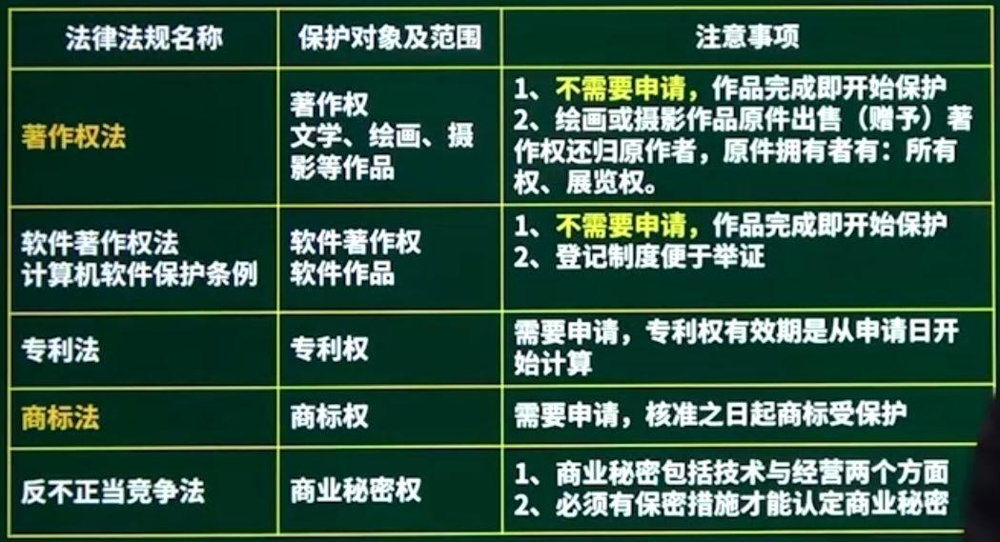
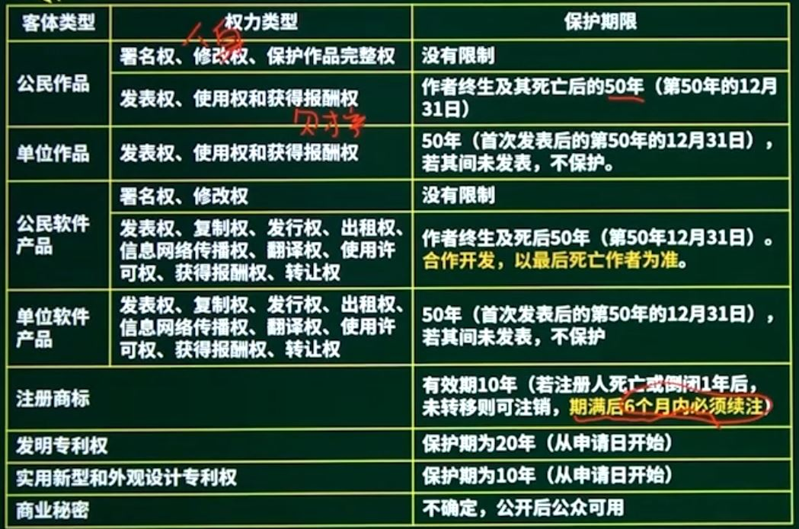
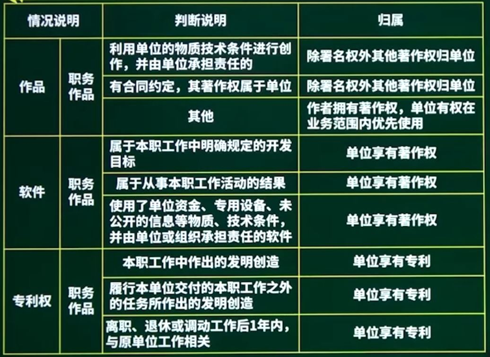
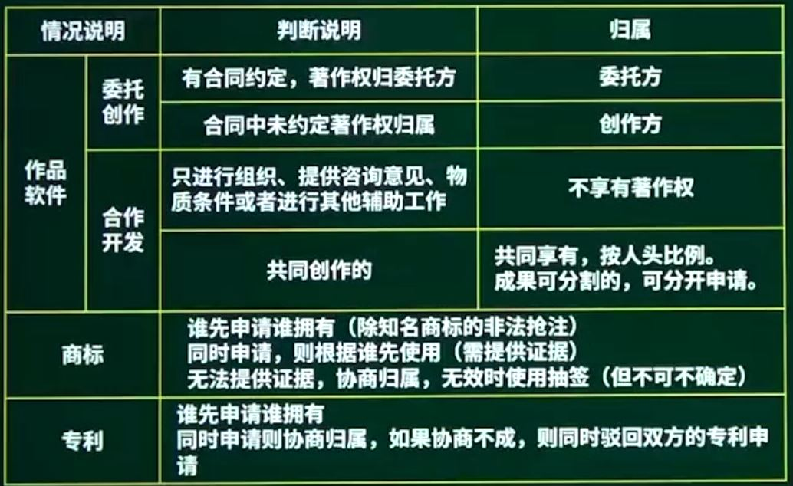
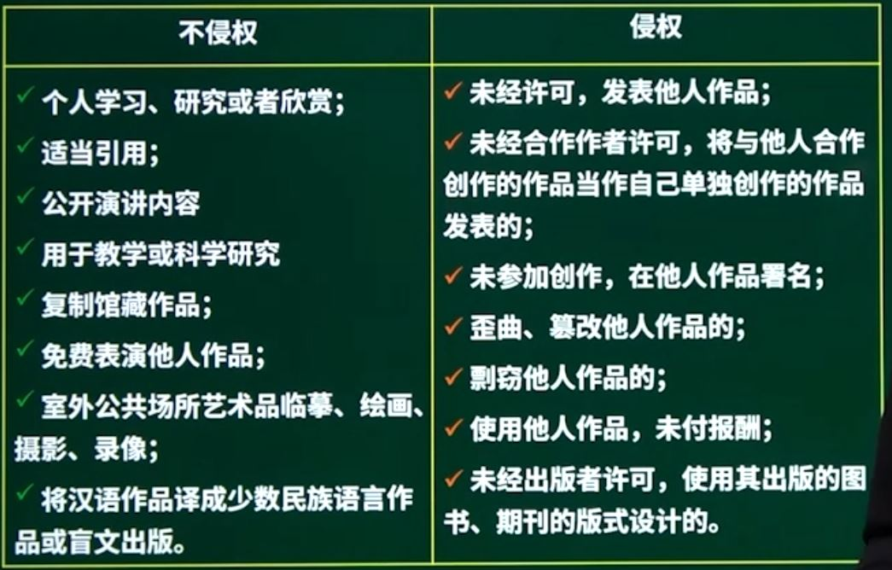

##  第16章 知识产权与标准化

### 1. 知识产权概述

知识产权是指人们就其智力劳动成果所依法享有的专有权力，通常是国家赋予创造者对其智力成果在一定时期内享有的专有权或独占权。

特点：

* 无形性
* 独占性
* 双重性
* 地域性
* 确认性
* 时间性

### 2. 保护范围与对象

软件作品：程序、数据和文档都属于软件作品

### 3. 保护期限

* 商标权可以永久有效，只需续注即可

### 4. 知识产权人确定

* 委托开发

* 专利权

  申请原则

  * 一份申请一项发明
  * 两个或两个以上的申请，专利授给最先申请人

* 商业秘密：《反不正当竞争》

  * 经营秘密
  * 技术秘密

* 商标注册：商标具备可视性（显著性）

  * 要求商标的构成要素必须便于区别、不能相同或近似
  * 读音相同属于相同商标
  * 读音近似，含义非常近似，其思想主题相同，属于近似商标

### 5. 侵权判定

中国公民、法人或者其他组织的作品，不论是否发表，都有著作权

开发软件所用的思想、处理过程、操作方法或者数学概念不受保护

### 6. 标准化

> 暂未考查过

