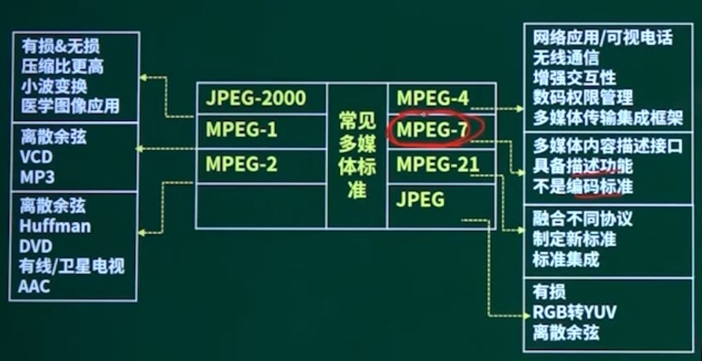
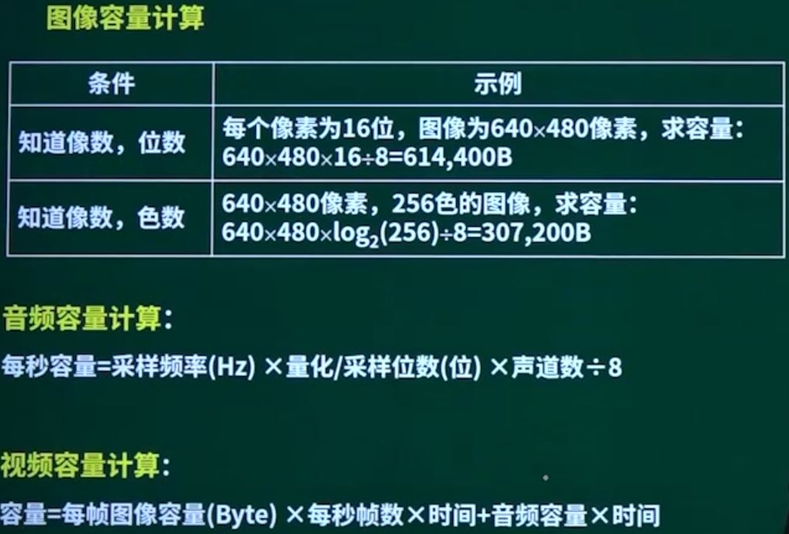

## 第17章 多媒体基础知识

### 1. 多媒体概念

多媒体：

* 指存储信息的实体，如磁盘、光盘、磁带等
* 指传递信息的载体，如数字，文字，图像等

### 2. 多媒体技术

### 3. 多媒体分类

* 感觉媒体：声音、图形、图像、动画
* 表示媒体：各种编码方式，文本编码、图像编码和声音编码等
* 显示媒体：输入显示媒体、输出显示媒体
* 存储媒体：磁盘光盘等
* 传输媒体：电缆、光缆和交换设备等。

### 4. 多媒体标准

### 5. 图像、音频

色泽三要素：

* 亮度：彩色明暗深浅程度
* 色调：指颜色的类别
* 色饱和度：指某一颜色的深浅程度

彩色空间：

* RGB彩色空间
* CMY彩色空间：基于印刷处理 C青色 M紫红 Y黄色 K黑色
* YUV彩色空间：基于彩色电视
* HIS（HSV、HSB）彩色空间：H色调 I光的强度 S饱和度

声音的带宽：

* 人耳：20Hz - 20KHz
* 说话：300-3400Hz
* 乐器：20Hz - 20KHz

人对声音的感觉：

* 音量：用来表示声音的强弱，与声波的振幅有关
* 音调：人们感觉到的声音高低，与声波的频率有关
* 音色：人们感觉到的声音音质，与声波的波形形状有关

### 6. 多媒体容量计算（重点）

### 7. VR

