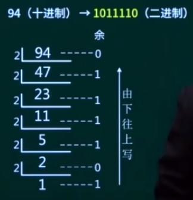

## 第1章 计算机系统基础

### 1. 数值转换

考点：

#### 1.1 进位计数制系统基本概念

数制、基数、数码、数位（个位、十位、百位）、位权

| 数制        | 十进制D       | 二进制B | 八进制Q     | 十六进制H       |
| ----------- | ------------- | ------- | ----------- | --------------- |
| 基本数码    | 0,1,2,3,...,9 | 0,1     | 0,1,2,...,7 | 0-9,A,B,C,D,E,F |
| 基数 / 底数 | r = 10        | r = 2   | r = 8       | r = 16          |
| 位权        | 10^n          | 2^n     | 8^n         | 16^n            |
| 形式表示符  | D             | B       | O           | H               |

> 整数部分：n从0开始，从右到左。
>
> 小数部分：n从-1开始，从左到右。

#### 1.2 数的转换

* R 进制转十进制

使用==按权展开法==，将R进制的每一位数值用 $R^k$形式表示，$R$为底数/基数，$k$为指数。

eg. 

二进制 ---> 十进制
$$
10100.01 = 1 \times 2^4 + 1 \times 2^2 + 1 \times 2^{-2}
$$
八进制 ---> 十进制
$$
604.01 = 6 \times 8^2 + 4 \times 8^0 + 1 \times 8^{-2}
$$

* 十进制转 R 进制

使用==短除法==

* 二进制转八进制

从左往右，每三位二进制表示一位八进制
$$
010\ 001\ 110 == 2\ 1\ 6
$$

* 二进制转十六进制

从左往右，每四位二进制表示一位十六进制
$$
1000\ 1110 == 8\ E
$$

#### 1.3 数据的存储单位

在计算机中，数据的最小存储单位为==BIT==，1比特为1个二进制位。字节（==Byte, B==），1个字节表示8个比特，即8个二进制位。换算关系为：
$$
1B = 8 bit\\
1KB = 1024 \ B = 2^{10}B\\
1MB = 1024 \ KB = 2^{20}B\\
1GB = 1024 \ MB = 2^{30}B\\
$$

### 2. 数据的表示

考点：

机器数，码制：

* 原码：最高位表示符号位，0为正，1为负，剩下部分为数值位。

* 反码：正数的表示和原码相同，负数的符号位不变，0为正，1为负，数值位全部取反。

* 补码：正数的表示和原码相同，负数的符号位不变，0为正，1为负，数值位取反后加1，**常用于加减法运算，部分计算机数的表示、存储**。

* 移码：在补码的基础上，数值位不变，符号位取反，**常用于浮点数的阶码**。

计算机中出现这么多码制的原因归根结底还是为了方便运算，采用补码的形式表示数值，将**符号位参与运算**，可以将数值计算中的减法运算转变为加法运算，简化计算机硬件，从以下表格中可以看到补码的作用：

| 码制 | 数值+1    | 数值-1    | 1+(-1)          |
| ---- | --------- | --------- | --------------- |
| 原码 | 0000 0001 | 1000 0001 | 1000 0010（-2） |
| 反码 | 0000 0001 | 1111 1110 | 1111 1111（-0） |
| 补码 | 0000 0001 | 1111 1111 | 0000 0000（0）  |
| 移码 | 1000 0001 | 0111 1111 | 1000 0000       |

> 求反码十进制的真值需要首先将反码变为原码，符号位不变，数值位取反，可以看到反码在计算机中可以两种0（1111 1111，0000 0000）的表示方法，浪费计算机资源。而补码只有一个0的表示方法，同时对于1111 1111固定表示 -128，可以多表示一个数。

| 码制 | 取值范围 |
| ---- | -------- |
| 原码 |          |
| 反码 |          |
| 补码 |          |
| 移码 |          |

### 3. 计算机的组成

### 4. 流水线

### 5. 多级存储结构

### 6. I/O控制方式【重点】

### 7. 可靠性、校验码

