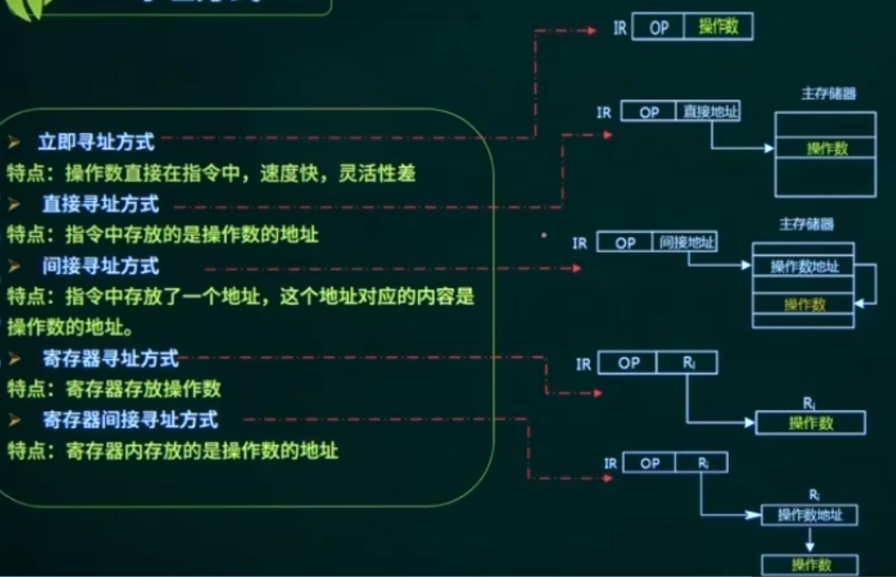

## 第1章 计算机系统基础

### 1. 数值转换

考点：

#### 1.1 进位计数制系统基本概念

数制、基数、数码、数位（个位、十位、百位）、位权

| 数制        | 十进制D       | 二进制B | 八进制Q     | 十六进制H       |
| ----------- | ------------- | ------- | ----------- | --------------- |
| 基本数码    | 0,1,2,3,...,9 | 0,1     | 0,1,2,...,7 | 0-9,A,B,C,D,E,F |
| 基数 / 底数 | r = 10        | r = 2   | r = 8       | r = 16          |
| 位权        | 10^n          | 2^n     | 8^n         | 16^n            |
| 形式表示符  | D             | B       | O           | H               |

> 整数部分：n从0开始，从右到左。
>
> 小数部分：n从-1开始，从左到右。

#### 1.2 数的转换

* R 进制转十进制

使用==按权展开法==，将R进制的每一位数值用 $R^k$形式表示，$R$为底数 / 基数，$k$为指数。

eg. 

二进制 ---> 十进制
$$
10100.01 = 1 \times 2^4 + 1 \times 2^2 + 1 \times 2^{-2}
$$
八进制 ---> 十进制
$$
604.01 = 6 \times 8^2 + 4 \times 8^0 + 1 \times 8^{-2}
$$

* 十进制转 R 进制

使用==短除法==

* 二进制转八进制

从左往右，每三位二进制表示一位八进制
$$
010\ 001\ 110 == 2\ 1\ 6
$$

* 二进制转十六进制

从左往右，每四位二进制表示一位十六进制
$$
1000\ 1110 == 8\ E
$$

#### 1.3 数据的存储单位

在计算机中，数据的最小存储单位为==BIT==，1比特为1个二进制位。字节（==Byte, B==），1个字节表示8个比特，即8个二进制位。换算关系为：
$$
1B = 8 bit\\
1KB = 1024 \ B = 2^{10}B\\
1MB = 1024 \ KB = 2^{20}B\\
1GB = 1024 \ MB = 2^{30}B\\
$$

### 2. 数据的表示

考点：

#### 2.1 机器数，码制

​	a. 原码：最高位表示符号位，0为正，1为负，剩下部分为数值位。

​	b. 反码：正数的表示和原码相同，负数的符号位不变，0为正，1为负，数值位全部取反。

​	c. 补码：正数的表示和原码相同，负数的符号位不变，0为正，1为负，数值位取反后加1，**常用于加减法运算，部分计算机数的表示、存储**。

​	d. 移码：在补码的基础上，数值位不变，符号位取反，**常用于浮点数的阶码**。

计算机中出现这么多码制的原因归根结底还是为了方便运算，采用补码的形式表示数值，将**符号位参与运算**，可以将数值计算中的减法运算转变为加法运算，简化计算机硬件，从以下表格中可以看到补码的作用：

| 码制 | 数值+1    | 数值-1    | 1+(-1)          |
| ---- | --------- | --------- | --------------- |
| 原码 | 0000 0001 | 1000 0001 | 1000 0010（-2） |
| 反码 | 0000 0001 | 1111 1110 | 1111 1111（-0） |
| 补码 | 0000 0001 | 1111 1111 | 0000 0000（0）  |
| 移码 | 1000 0001 | 0111 1111 | 1000 0000       |

> 求反码十进制的真值需要首先将反码变为原码，符号位不变，数值位取反，可以看到反码在计算机中可以两种0（1111 1111，0000 0000）的表示方法，浪费计算机资源。而补码只有一个0的表示方法，1111 1111即可以表示-1，【也可以表示-128，此时这数没有对应的原码和反码】(存疑)。同时对于1000 0000固定表示 -128，可以多表示一个数，

| 码制 | 取值范围                                   |
| ---- | ------------------------------------------ |
| 原码 | $-(2^{n-1}-1)$ ～ $2^{n-1}-1$（$2^n-1$个） |
| 反码 | $-(2^{n-1}-1)$ ～ $2^{n-1}-1$（$2^n-1$个） |
| 补码 | $-2^{n-1}$～ $2^{n-1}-1$ （$2^n$个）       |
| 移码 | $-2^{n-1}$～ $2^{n-1}-1$（$2^n$个）        |

#### 2.2 定点数与浮点数

​	a. 定点数：小数点的位置固定不变的数，小数点不需要占用一位二进制，具体分为定点整数和定点小数。

​	b. 浮点数：$N=R^e \times M$，其中 M 称为尾数，e是指数（阶码），R为基数（阶码的底），浮点数在计算机中的存储方式如下表所示：

| 阶符 | 阶码 | 数符 | 尾数 |
| ---- | ---- | ---- | ---- |

​	阶符：阶码的符号，表示正负。

​	阶码：决定数值表示的范围。

​	数符：不是尾数的符号，表示的是 N 的正负符号。

​	尾数：决定数值表示的精度。

> 当尾数的小数点向左移1位时，阶码加1。

浮点数在计算机中的计算步骤为：

​													对阶 ---> 尾数计算 ---> 结果格式化

### 3. 计算机的组成

考点：

计算机的五大组成部分：存储器、运算器、控制器、输入设备、输出设备。

存储器的组成部分及其作用：

1. 算术逻辑单元ALU：数据的算术运算和逻辑运算。
2. 累加寄存器AC：通用寄存器，为ALU提供一个工作区，用在暂存数据。
3. 数据缓冲寄存器DR：写内存时，暂存指令或数据。
4. 状态条件寄存器PSW：存状态标志与控制标志。（争议：也有将其归为控制器的）

控制器的组成部分及其作用：

1. 程序计数器PC：存储下一条要执行指令的地址。
2. 指令寄存器IR：存储即将执行的指令。
3. 指令译码器ID：对指令进行分析解释。
4. 时序部件：提供时序控制信号指令中的操作码字段。

#### 3.1 计算机系统的基本概念

* CPU的性能指标：主频、字长、CPU缓存、核心数量
* 总线的分类：数据总数、控制总线、地址总线
* 总线的性能指标：带宽、位宽、工作频率
* BIOS（基本输入输出程序，保存ROM芯片中）/CMOS（RAM芯片，电池供电，保存BIOS数据，断电不丢失数据）
* 系统性能评测方法：时钟频率、指令执行（KIPS/MIPS）、等校指令速度法、数据处理速率（PDR）、核心程序法、基准测试程序。

#### 3.2 总线系统

一条总线同一时刻仅允许一个设备发送，但允许多个设备接受。

总线的分类：

* 数据总线（双向）：在CPU与RAM之间来回传送需要处理或是需要存储的数据。
* 地址总线（单向）：用来指定在RAM之间存储的数据的地址。
* 控制总线（双向）：将微处理器控制单元的信号传送到周边设备。

总线的性能指标：

​	带宽（bit/s，单位时间内能处理的数据量） = 位宽（bit，总线宽度）x 工作频率（Hz, 1/s）

#### 3.3 计算机指令

一条指令就是机器语言的一个语句，是一组有意义的二进制代码。

#### 3.4 寻址方式

立即寻址、直接寻址、间接寻址、寄存器寻址、寄存器间接寻址。

### 4. 流水线

考点：

流水线：多条指令重叠进行操作的一种准并行处理实现技术。

我们可以将一条指令的运行分为三个阶段：取指 ---> 分析 ---> 执行。

>  1、2、3分别为三条不同的指令。

#### 4.1 流水线周期

流水线周期（$\triangle t$）：指的是流水线执行时间最长的一段时间（这里是指取值、分析或执行中所花最长时间的一段）。

流水线计算公式：

k条指令执行完所需的时间（$T_k$） = 一条指令执行时间 + （指令条数 - 1）* 流水线周期

* 理论公式（常用）：$(t_1 + t_2 +...+t_k)+(n-1)*\triangle t$

* 实践公式：$k*\triangle t + (n -1)*\triangle t$

流水线的吞吐率（TP）计算的最基本公式为：
$$
TP=\frac{n}{T_k}
$$
流水线的最大吞吐率：==流水线周期的倒数$\frac{1}{\triangle t}$==

### 5. 多级存储结构

存储器被组织成金字塔形的层次结构：

存储器自上而下，组成6个层次结构，依次变得更慢、访问频率更低、容量更大、每个字节的造价更便宜。

#### 5.1 Cache

##### 5.1.1 什么是Cache

* 功能：提高CPU数据输入输出的速率，突破所谓的“冯*诺依曼瓶颈”。
* 速度：在计算机的存储系统体系中，Cache是访问速度较快的层次。
* 原理：使用Cache改善系统性能的依据是程序的局部性原理。
* 组成：Cache由两部分组成：控制部分和Cache存储器部分。

**平均系统周期时间**（以读操作为例：使用“Cache + 主存储器”）
$$
t_3=h\times t_1+(1-h)\times t_2
$$
$h$代表对Cache的访问命中率，$t_1$表示Cache的周期实践，$t_2$表示主存储器周期时间，系统的平均周期为$t_3$，（1-h）又称为失效率（未命中率）。

##### 5.1.2 地址映像

在计算机运行的过程中，需要知道Cache与内存地址的影射关系，需要由一块存储器保存相关映射数据，成为地址映像。

* 通常是由SRAM（Static Random Access Memory静态存储器）组成，其访问速度远高于主存，接近CPU。
* 其功能是提高CPU数据输入输出的速率。其理论依据是程序的局部性原理，实现基础是将主存和Cache划分为大小相同的块/页。
* 装入缓存时将主存块与Cache块的映射关系存入相联存储表（硬件实现）中。
* CPU通过主存地址访存时先访问Cache（命中可提高速度，所以其关键性性能指标是命中率），依据==主存地址关联相联存储表==转换为Cache地址。如果在Cache中没有，才需要访问主存（Cache页置换，置换算法也会影响命中率）。

##### 5.1.2 地址映像方式

* 直接映像和变换

  * 主存储器中一块只能映像到Cache的一个特定块中
  * 主存与缓存分成相同大小的数据块
  * 主存空间按缓存容量分成区，每一区的块数与缓存的总块数相等。
  * 主存中某区的一块存入缓存时只能存入缓存中块号相同的位置。

  

  ​	从图中分析可知，这里Cache中的主存区号是会变化的，其取值范围为 0 ～ M，以Cache的第0块为例，主存区号可以为0，1，...，M；所以如果Cache命令，则主存区号应相同。

  特点：

  * 地址变换电路简单，访问速度快
  * 空间利用率低，冲突概率高
  * 对页面置换算法以来度较高，且Cache空间利用率较低，命中率较低。

  > 具体可以进一步参考： https://blog.csdn.net/qq_57502075/article/details/130307388

* 全相联地址映像和变换

  * 主存的任意一块可以映像到cache中的任意一块的位置上
  * 主存与缓存分成相同大小的数据块
  * 主存的某一数据块可以装入缓存的任意一块空间中

  

  特点：

  * 空间利用率高，命中率较高
  * 冲突概率低
  * 实现复杂，速度慢，适合小容量cache

* 组相联地址映像和变换

  * 主存和cache按相同大小分块
  * cache分为若干组，如两块一组，主存按cache组数分区
  * 每个组采用直接映射方式
  * 组内的块则采用全相联映像方式

  

  

  

  特点：

  * 是以上两种方式的折衷
  * 实现难度和造价要比直接映像方式高

### 6. I/O控制方式【重点】

##### 6.1 输入输出设备管理

* 直接程序控制：无条件传送方式、程序查询方式
* 中断方式
* 直接存储器存取方式（DMA）：在传送数据块的过程中不需要CPU干涉（过程开启和结束时需要CPU处理，传送数据过程中不需要CPU干预。）
* 输入输出处理机（IOP）

### 7. 可靠性、校验码

##### 7.1 可靠性计算

##### 7.2 校验码

奇偶校验码、循环冗余校验码（CRC）、海明校验码

* 什么是码距？

  一个编码系统的码距就是整个编码系统中任意（所有）两个码字（==合法编码==）的最小距离。

* 不同种类的校验码

  * 奇偶校验码：仅可检错，可检测1（奇数）位错。
  * CRC：仅可检错，可检测多位错。
  * 海明码：可检错，且可纠1位错。

>  注意通过海明码的计算公式，计算可以得到最少需要插入的校验位。
