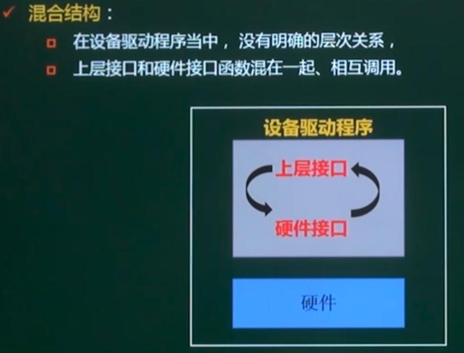

## 第2章 嵌入式系统软件及操作系统

### 1. 嵌入式软件基础

#### 1.1 嵌入式软件的特点

* 规模较小
* 开发难度大：硬件资源有限、设计底层软件开发，需要软硬件基础、开发环境和运行环境不同。
* 时实性和可靠性要求高
* 要求固化存储

#### 1.2 嵌入式软件分类

| 分类     | 功能                                                 | 作用设备                                       |
| -------- | ---------------------------------------------------- | ---------------------------------------------- |
| 系统软件 | 控制、管理系统的资源                                 | 嵌入式操作系统、嵌入式中间件                   |
| 支撑软件 | 辅助软件开发的工具软件                               | 系统分析设计工具、仿真开发工具、交叉开发工具等 |
| 应用软件 | 定义嵌入式设备的主要功能和用途，负责与用户进行交互。 | 手机软件、路由器软件、交换机软件、飞控软件等   |

* 系统软件：控制和管理嵌入式系统的资源，如嵌入式操作系统、驱动程序、中间件等。
* 支撑软件：辅助软件开发的工具软件。
* 应用软件：定义嵌入式设备的主要功能和用途，负责与用户进行交互。

#### 1.3 嵌入式软件的体系结构（重点）

* 无操作系统阶段

  * 硬件配置较低，系统应用主要集中在控制领域
  * 嵌入式软件的设计以应用为核心，应用软件直接建立在硬件上

  无操作系统的嵌入式软件的两种实现方式：

  * 循环轮转：把系统功能分解为软件不同的任务，将它们包含在一个永不结束的循环语句中，按照顺利逐一执行。
  * 前后台系统（在循环轮转的基础上增加了中断处理功能）
    * 前台程序（事件处理级）：中断服务程序，负责处理异步事件。
    * 后台程序（任务级）：一个无限循环，负责资源分配、管理和系统调度。在系统运行时，后台程序会检查每个任务是否具备运行条件，对实时性要求严格和操作通常由中断完成。
    * 前后台系统认为所有的任务具有相同的优先级，任务的执行是通过先进先出队列排队完成
    * 实时性较差。

* 有操作系统阶段

  开发应用程序不再直接面对嵌入式硬件设备，而是在操作系统的基础上编写，优点有：

  * 提高系统的可靠性
  * 提高了系统的开发效率，降低了开发成本，缩短了开发周期
  * 有利于系统的扩展和移植。 

  有操作系统嵌入式软件的体系结构：

  

#### 1.4 设备驱动层BSP（重点）

也叫板级支持包（BSP），包含了嵌入式系统中的所有与硬件相关的代码。

* 大多数的嵌入式硬件设备都需要某种类型软件的初始化和管理
* 这部分工作由设备驱动层来完成，他负责直接与硬件打交道，对硬件进行管理和控制，为上层软件提供所需要的驱动主持，类似PC系统中的BIOS和驱动程序
* ==一般认为，BSP属于操作系统的一部分==

板级支持包BSP（Board Support Package）

* 把嵌入式操作系统与具体的硬件平台隔离开来
* 即在BSP当中，把所有与硬件相关的代码都封装起来，向上提供一个虚拟的硬件平台，操作系统就运行在这个虚拟的硬件平台上
* 操作系统使用一组定义好的编程接口来与BSP进行交互，并通过BSP来访问真正的硬件。

##### 1.4.1 **BSP的组成**：

1. **引导加载程序Boot Loader**：嵌入式系统加电后运行的第一段软件代码，是操作系统内核运行之前的一段小程序。通过这段程序，可以初始化硬件时被，建立内存空间的映射图。并将系统的软硬件环境设置到一个合适的状态，为最终操作系统内核作准备。

2. **设备驱动程序**

##### 1.4.2 Boot Loader的实现：

​	Boot Loader的实现高度依赖于具体的硬件平台，主要的基本功能如下：片级初始化、板级初始化、加载内核

* 片级初始化：
  * 主要完成==微处理器==的初始化
  * 包括设置微处理器的核心寄存器和控制寄存器、微处理器的核心工作模式、局部总线模式等
  * 把微处理器从上电的默认状态设置成系统要求的工作状态
  * ==纯硬件==初始化过程
* 板级初始化
  * 设置各种硬件寄存器来完成微处理器以外的其他硬件设备的初始化
  * 设置某些软件的数据结构和参数
  * 同时有==软件和硬件==的初始化过程
* 加载内核
  * 将操作系统和应用程序的映像从Flash存储器复制到系统内存中
  * 然后跳转到系统内核的第一条指令处继续执行。

​	可以看到Boot Loader的功能兼具PC系统中的BIOS程序和MBR程序功能。

##### 1.4.3 设备驱动层

* 在一个嵌入式系统中，操作系统可能有也可能无，设备驱动程序是必不可少的
* 设备驱动程序是一组库函数，用来对硬件进行初始化，并向上层软件提供良好的访问接口
* 大多数设备驱动程序都具备下面的基本功能：启动、关闭、停用、启动、读操作、写操作。

​	

##### 1.4.4 设备驱动程序的组织结构

特定的功能一般用函数的形式来实现，这些函数之间的组织结构主要有两种：分层结构、混合结构

* 分层结构

* 混合结构

#### 1.5 嵌入式中间件

==中间件==：在操作系统内核、设备驱动程序和应用软件之外的所有系统软件。

基本思路：

* 把原本属于应用软件的一些通用的功能模块抽取出来，形成独立的一层软件，从而为运行在他上面的那些应用软件提供一个灵活、安全、移植性好、相互通信、协同工作的平台。

特点：

* 可以有效地实现软件的可重用，降低应用软件的复杂性，提高系统的开发效率，缩短开发周期，节约开发成本和维护费用，保证了系统的高伸缩性、易升级性、稳定性。
* 会带来额外的开销。

分类：

嵌入式中间件可以分为：消息中间件、对象中间件、远程过程调用、数据库访问中间件、安全中间件等。

#### 1.6 嵌入式软件运行的流程

很少考，了解即可

### 2. 嵌入式操作系统概述

#### 2.1 嵌入式操作系统的基本概念

嵌入式操作系统（Embedded Operating System, EOS）具有一般操作系统的功能，同时具有嵌入式软件的特点，主要有：

* 非通用型操作系统
* 在性能和实时性方面可能有严格的限制
* 能源、成本和可靠性通常是影响设计的重要因素
* 占用资源少
* 可裁减、可配置

不同嵌入式操作系统的组件各不相同，但所有操作系统都会有一个内核。==内核==是操作系统的一个组件，它包含了OS的主要功能，即OS的各种特性及其相互之间的依赖关系。

内核的主要功能：

* 任务管理：对系统中运行的软件进行描述和管理，并完成处理器资源分配和调度
* 存储管理：提高内存的利用率，方便用户使用，提供足够的存储空间
* I/O设备管理：方便设备的使用，提高CPU和I/O设备的利用率
* 文件管理：解决文件资源存储、共享、保密和保护等问题

不同嵌入式操作系统的内核设计各不相同，不一定包含所有的4个功能模块，取决于系统设计和实际需求。

#### 2.2 嵌入式操作系统的分类

按照系统类型分3类：

* 商用系统
* 专用系统
* 开源系统

按照系统对响应时间的敏感程度分为3类：

* 硬实时系统
* 软实时系统
* 非实时系统：如分时操作系统。

按软件体系结构分三类，这3类系统的差异主要体现在内核的设计（内核中包含的功能组件），在系统中集成的其他系统软件：

* 单体结构（uC/os）

* 分层结构（MS-DOS）

* 微内核结构（Vxworks）

微内核结构的优点：

* 内核非常小
* 易于扩展、调试方便：新功能组件可以被动态添加
* 安全性更高：大部分的系统功能被放置在内核之外
* 可移植性

缺点：

* 通过微内核构造和发送信息、接受应答并阶码所花费的时间比进行一次系统调用的时间多
* 很大程度取决于微内核的大小和功能
* 客户单元和服务器单元的内存地址空间是相互独立，在切换时后会增加额外开销。

#### 2.3 常见嵌入式操作系统

选择题中易考

