## 第3章 操作系统知识

### 1. 操作系统的作用

通过资源管理（软硬件资源管理），提高计算机系统的效率，改善人际界面，向用户提供友好的工作环境。

操作系统的功能可以分为相互配合、协调工作的5大部分，分别为：

* 进程管理
* 文件管理
* 存储管理
* 设备管理
* 作业管理

### 2. 进程（任务）管理

#### 2.1 进程的概念

进程是程序在一个数据集合上运行的过程，它是系统进行==资源分配和调度的一个独立单位==，它由程序块进程控制块（PCB）和数据块三部分组成。

进程和程序的区别：

* 进程是程序的一次执行过程，没有程序就没有进程
* 程序是完成某个特定功能的一系列程序的集合，只要不被破坏，它就永远存在。
* 程序是一个静态的概念，而进程是一个动态的概念，它由创建而产生，完成任务后因撤销而消亡；进程是系统进行资源分配和调度的独立单位，而程序不是。

#### 2.2 进程状态：三态模型

* 运行态：占有处理器正在运行
* 就绪态：指具备运行条件，等待系统分配处理器以便运行
* 等待态：又称为阻塞泰或睡眠态，指不具备运行条件，正在等待某个事件的完成

**状态转换**

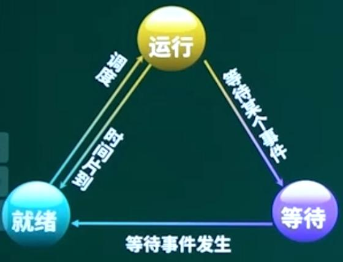

* 运行态 ---> 等待态：等待使用资源，如等待外设传输，等待人工干预。
* 等待态---> 就绪态：资源得到满足，如外设传输结束，人工干预完成。
* 运行态---> 就绪态：运行时间片到，出现有更高优先权进程。
* 就绪态---> 运行态：CPU空闲时选择一个就绪进程。

#### 2.3 进程状态：五态模型

运行、活跃就绪、活跃阻塞、静止就绪、静止阻塞。

* 挂起：将进程调出内存，保存到外存队列中，并释放资源。
* 激活：==恢复挂起进程，重新调入内存==。
* 目的：释放进程占用的资源以缓解资源不足
* 原因：终端用户的请求，父进程的请求、OS的需要（如负荷调节、对换等）

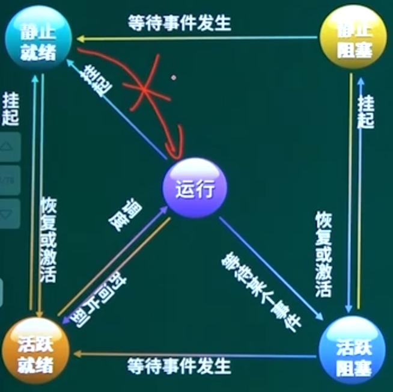

> 注意运行态只能由活跃就绪态转入。

#### 2.4 进程管理

* 前驱图

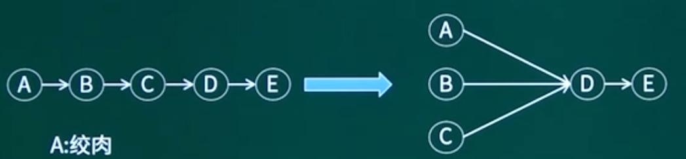

注意出度和入度两个概念。

* 进程的同步和互斥

互斥：间隔制约

同步：直接制约

* 同步与互斥：生产者和消费者

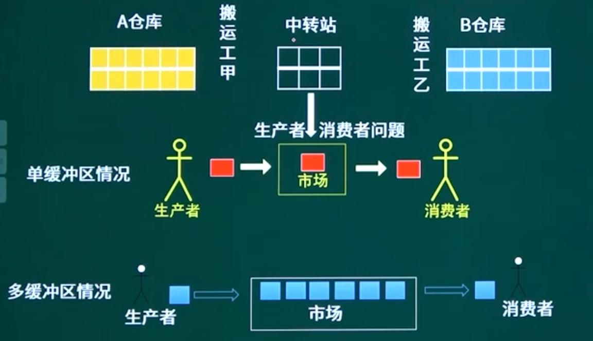

* P、V操作与PV原语的使用

临界资源：诸进程间需要互斥方式对其进行共享的资源，如打印机、磁带机等

临界区：每个进程中访问临界资源的那段代码称为临界区

信号量：是一种特殊的变量

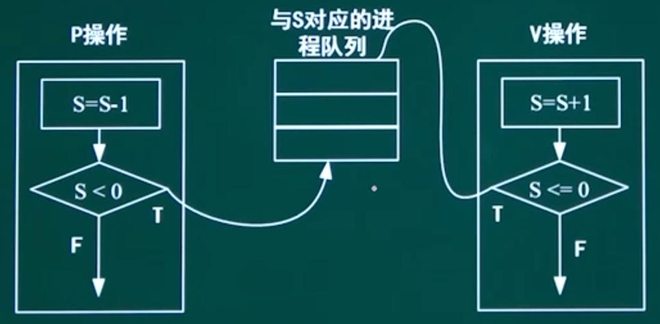

S：资源个数

P操作：申请资源，阻塞进程

V操作：释放资源，唤醒进程

**以生产者和消费者为例：**

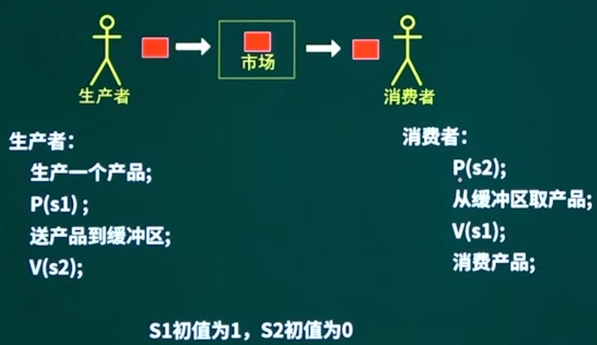

S1为空余缓冲区数，S2为资源数

值得注意的是，P操作申请资源时，S1会先减1，即使减1后S1<0，生产者进程阻塞，S1的减操作也不会撤销，此时S1的值变为-1，需要消费者资源加回去。

> 这里的例题值得一看：
>
> https://www.bilibili.com/video/BV1ch4y1V7sj/?p=3&spm_id_from=333.1007.top_right_bar_window_history.content.click&vd_source=89928f4f29ee22619e6cca9c6bc5635f

#### 2.5 死锁

死锁：进程管理是操作系统的核心，但如果设计不当，就会出现死锁的问题，如果一个进程在等待一个不可能发生的事，则进程就死锁，而如果一个或多个进程产生死锁，就会造成系统死锁。

**系数的资源数与进程关系:**

假设有两个进程A和B，都需要资源数3，系统资源总数为4，若资源分配不当，A和B各获得了2个资源，就会发生死锁，但只要再补充一个系统资源，不论怎么分配，A和B都不会发生死锁。

如例题所示

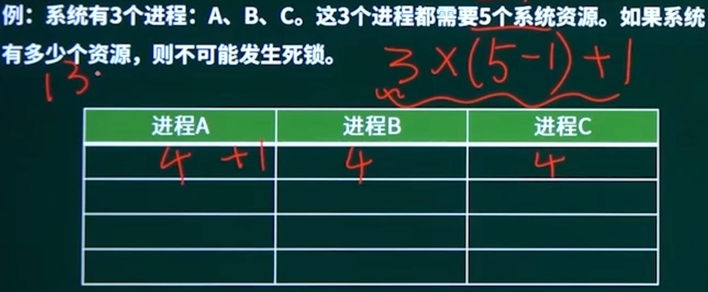

为了避免死锁，系统所需要的最大资源数为：

n = 进程数 x (系统所需的最大资源数  - 1) + 1

**死锁解决：**

死锁产生的四个必要条件：互斥、环路等待、不剥夺、保持和等待

死锁的预防：打破四大条件

死锁的避免：有序资源分配法、银行家算法。

**银行家算法**：分配资源的原则

* 当一个进程对资源的最大需求量不超过系统中资源数时可以接纳该进程。
* 进程可以分期请求资源，但请求的总数不能超过最大需求量
* 但系统现有的资源不能满足进程尚需资源数时，对进程的请求可以推迟分配，但总能使进程在有限的时间里得到资源。

> 银行家算法例题：
>
> https://www.bilibili.com/video/BV1ch4y1V7sj/?p=3&spm_id_from=333.1007.top_right_bar_window_history.content.click&vd_source=89928f4f29ee22619e6cca9c6bc5635f

#### 2.6 任务的调度

任务调度要解决的问题：

* When：何时分配CPU
  * 任务调度的时机，5种情形
* How：如何分配CPU
  * 任务调度方式，不可抢占、可抢占
* What：按什么原则分配CPU
  * 任务调度算法：先来先服务、短作业原则、时间片轮转调度、优先级算法
  * 调度算法的性能指标

##### 2.6.1 调度器

* 调度用来确定多任务环境下任务执行的顺序和在获得CPU资源后能够执行的时间长度。

* 操作系统通过一个==调度程序==来实现调度功能
  * 调度程序以函数的形式存在，用来实现操作系统的调度算法
  * 调度程序本身并不是一个任务，是一个函数调用，可在内核的各个部分进行调用
* 调度程序：可以看作CPU的资源管理者
  * 从就绪队列中选择一个任务去运行
  * 调度算法：调度程序在决策过程中所采用的算法。

##### 2.6.2 任务调度的时机

* 程序创建：当一个新的任务被创建时，需要作出一个调度决策，是立即执行这个新任务还是继续执行父任务
* 程序结束：但一个任务运行结束时，它不再占用CPU，这时调度器必须作出决策，从就绪队列中选择某个任务执行。
* 程序阻塞：但一个任务由于I/O操作，信号量或其他原因被阻塞时，也必须另选一个任务运行。
* 程序就绪：当一个I/O操作被完成，而对应的程序由阻塞状态转变为就绪状态时。此时调度程序需决策是立即执行这个新就绪的任务【程序A，因为等待I/O操作被中断】，还是继续执行刚才被中断的任务【程序B，程序A中断过程中被调度执行的程序】。
* 程序中断：当一个时钟中断发生时，会唤醒一些延时任务或者可能会发现当前任务时间片已用完，从而把它变为就绪状态。

>在操作系统的任务调度中，任务被阻塞和任务被中断是两个不同的概念。
>
>* 任务被阻塞指的是任务由于某些原因（例如等待某个事件的发生）而无法继续执行，此时操作系统会将该任务从可执行队列中移除，直到该事件发生后再将其加入可执行队列中。
>
>* 任务被中断指的是任务在执行过程中被外部事件（例如硬件中断）打断，此时操作系统会暂停当前任务的执行，保存当前任务的上下文，然后转而执行中断处理程序。中断处理程序执行完毕后，操作系统会恢复被中断的任务的上下文，让其继续执行。 
>
>因此，任务被阻塞和任务被中断的区别在于，任务被阻塞是由任务自身的行为导致的，而任务被中断是由外部事件导致的。在任务被阻塞时，操作系统会主动将其从可执行队列中移除；而在任务被中断时，操作系统会暂停当前任务的执行，转而执行中断处理程序。

##### 2.6.3 调度方式

不可抢占调度方式：

* 如果一个任务被调度程序选中，就会一直运行下去，直到它因为某种原因（如I/O操作或任务间的同步）被阻塞了，或者它主动交出了CPU的使用权
* 调度时机中前3中情况（任务创建、任务运行结束、任务被阻塞），都可能会发生调度。第4、5种情况（即发生中断），不会发生调度，即发生各种中断的时候，虽然也会中断处理程序，但调度程序不会调度新的程序执行，而是等待中断处理完成，继续执行被打断的任务。

> ==注意这里任务被阻塞时，不可抢占调度由可能发生==

可抢占调度方式：

* 当一个任务正在运行的时候，调度程序可以去打断它，并安排其他任务去运行
* 调度时机中的5中情况都可能发生调度。

> 实时操作系统大都采用可抢占调度方式，使关键任务能够打断非关键任务的执行，确保关键任务的截至时间能够得到满足。

##### 2.6.4 调度算法

调度算法的性能指标：CPU使用率、响应时间、周转时间、调度开销、公平性、均衡性、吞吐量。

这些性能指标存在一定的冲突性，例如可以通过让更多任务处于就绪状态来提高CPU的使用率，但这会降低系统的响应时间。

调度算法：

* 先来先服务算法（First Come First Served, FCFS）
* 短作业优先算法（Shortest Job First, SJF）
* 时间片轮转调度算法（Round-robin scheduling, RR）
  * 所有就绪任务按照先来先服务的原则排成一个队列
  * 在每次调度的时候，把处理器分派给队列当中的第一个任务，让他去执行一个小段时间。在这个时间段里任务给阻塞或结束，或者任务的时间片用完，它会被送到就绪队列的末尾，然后调度器再执行队列中的第一个任务。
* 优先级算法
  * 可抢占时式：一个高优先级的任务就绪时，立即抢占CPU运行新任务
  * 不可抢占式：当一个高优先级的新任务就入就绪状态时，需等待当前任务执行完毕再决定。
  * 优先级的确定方式：静态方式、动态方式
* 优先级分组算法：在优先级算法中，把任务按照不同的优先级进行分组，不同组的任务使用优先级算法，同一组的各任务之间使用**时间片轮转法**。
  * 优先级反转问题：高优先级的任务需要等待低优先级任务释放资源，而低优先级任务又正在等待中等优先级任务的现象。

##### 2.6.5 任务间通信

任务间通信：任务之间为了协助工作，需要相互交换数据和控制信息。

任务之间的通信可以分为两种类型：

* 低级通信：只能传递状态和整数值等控制信息，例如信号量机制、异步信号机制

* 高级通信：能够传输任意数量的数据，主要有三类：==共享内存、消息传递、管道==

**共享内存**

各个任务共享其地址空间中的某些部分，在此区域，可以任务读写和使用任意数据结构，把它看成一个通用的缓冲区。

* 通常需要和任务间的互斥机制结合起来，以免产生竞争条件，确保数据顺利传送。

**消息传递**

内存空间中一段长度可变的缓冲区，其长度和内容均可以由用户定义【结构化数据】，其内容可以是实际的数据、数据块和指针或空。

对消息内容的解释由应用完成。

* 从操作系统来看，消息没有定义的格式，都是字节流。
* 从应用来看，根据应用定义的消息格式，消息被解释成特定的含义。
* 应用可以把消息当成一个标志，这时消息机制用于实现同步。

消息机制由操作系统来维护，包括定义寻址方式、认证协议、消息的数量等，一般提供2个基本操作：

* send操作：发送一条消息
* receive操作：接受一条消息

任务间的通信方式：

* ==直接通信==：在通信过程中双方必须明确地知道彼此
  * send(P, message)： 发送一条消息到任务P
  * receive(Q, message)：从任务Q接受一条消息
* ==间接通信==：通信双方不需要指出消息的来源和去向，而通过中间机制来通信。
  * send(A, message)：发送一个消息到邮箱A
  * receive(A, message)：从邮箱A接受一个消息

一些操作系统内核把消息进一步分为：==邮箱和消息队列==

* 邮箱仅能存放单条消息，它提供一种低开销的机制来传递消息，每个邮箱可以保存一条大小为若干字节的消息。
* 消息队列可存放若干消息，提供了一种任务间缓冲通信的方法，间接通信方式。

**管道**

提供**非结构化数据**交换和实现任务间同步的内核对象，在传统实现中，管道是单向数据交换设施，管道空时阻塞读者，管道满时，阻塞写者。

管道与消息队列的区别：

* 管道不存在多个消息，它存储的数据是非结构化的字节流。
* 管道中的数据严格地遵循先进先出的顺序。
* 管道支持选择操作，而消息队列不支持。

#### 2.7 中断的处理过程

> https://blog.csdn.net/Sugar_wolf/article/details/134313363

中断的处理过程分为硬件自动处理部分和软件处理部分

硬件处理：

* 关中断：进入不可相应中断请求的状态
* 保存断点：将当前程序计数器PC中的内容保存起来，用于中断处理结束后继续执行主程序
* 时别中断源：有多个中断源同时请求时，只响应最高级别，因此需要进一步时别中断源

软件处理：

* 保存现场和屏蔽字：进入中断服务程序后，要先保存现场
* 设置新的屏蔽字：用于改变中断优先级和控制中断的产生
* 开中断：执行中断程序时，打开中断可以实现中断嵌套
* 执行中断服务程序
* 关中断：使得恢复现场和屏蔽字时不会被打断
* 恢复现场和屏蔽字
* 再次开中断：中断执行完成，现场恢复完毕
* 中断返回：返回源程序继续执行

==中断发生时，操作系统通过检查中断向量来判断中断原因==

### 3. 存储管理

| 分区方法 | 单一连续分配                         | 固定分区分配                           | 可变分区分配                             |
| -------- | ------------------------------------ | -------------------------------------- | ---------------------------------------- |
| 分区类型 | 静态分配法                           | 静态分配法                             | 动态分配法                               |
| 特点     | 不分区，所有用户空间给某个进程或作业 | 分成大下不等的区域，区域分区后固定不变 | 分成大小不等的区域，根据用户要求动态分配 |

可变分区分配算法：

最先匹配法、下次匹配法、最佳批匹配法、最坏匹配法。

#### 3.1 页式存储

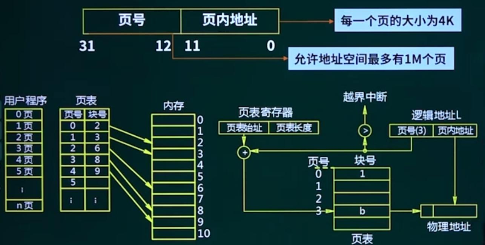

==考点：==需要知道从逻辑地址到物理地址的映射过程。

页式存储中，页的大小是固定的。逻辑地址中的页内地址直接对应物理地址，页号则需要通过页表映射找到块号，将块号作为实际的物理地址。注意，块号直接搬运作为物理地址即可，无需重新映射。

优先：利用率高，碎片小，分配及管理简单。

缺点：增加了系统开销，可能产生抖动现象。

#### 3.2 段式存储

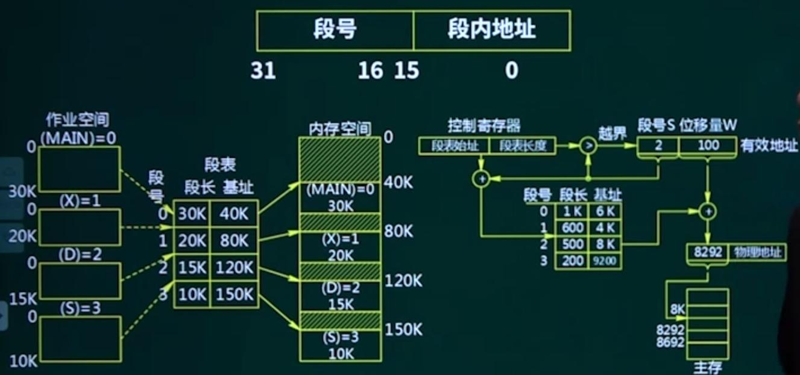

段的大小不固定，和任务所需的内存空间有关，段表中保存有段长和基址，段长表示当前段的最大长度，而基址指的是实际内存的物理地址。段式存储的逻辑地址映射到实际地址，首先要通过段号找到段表，确定当前段号所对应的段长和基址，然后将基址加上位移量，即可得到当前段所在内存实际的物理地址。

优点：多道程序共享内存，各段程序修改互不影响。

缺点：内存利用率低，内存碎片浪费大。

#### 3.3 段页式存储

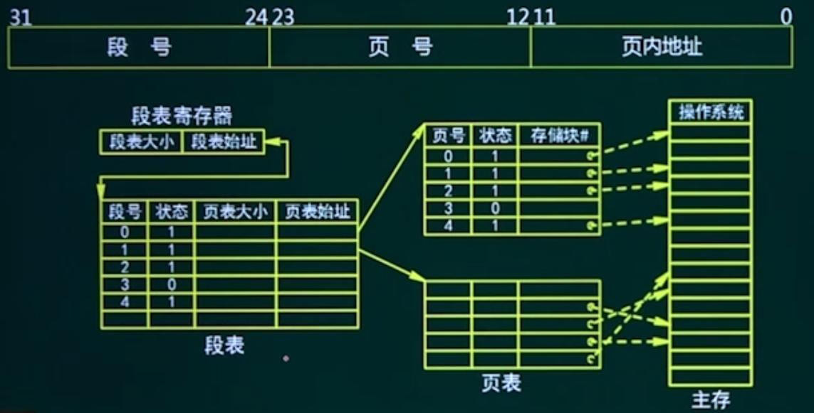

逻辑地址到物理地址的映射过程：首先通过段表寄存器找到段表所在内存，再通过段号找到当前段号所对应的页表所在内存，然后通过页号映射到实际的物理内存，最后加上页内地址完成整个映射

优点：空间浪费小、存储共享容易、存储保护容易、能动态连接

缺点：由于管理软件的增加，复杂性和开销也随之增加，需要的硬件以及占用的内容也有所增加，使得执行速度大大下降。

#### 3.4 虚拟存储器

实现方式：

* 请求分页系统
* 请求分段系统
* 请求段页式系统

性质：

* 具有部分装入和部分对换功能，能从逻辑上对内容容量进行大幅度扩充，使用方便的一种存储器。
* 实际上是为了扩大主存而存在的一种设计技巧
* 虚拟存储器的容量与主存大小无关
* 虚拟存储器的实现对用户来说是透明的

#### 3.5 页面置换算法

* 最佳置换算法：需要预知主存中每个页面将来要被访问的时间，置换出将来最久不被使用的页面到外存中，把页面留给当前任务使用，由于准确预知不可能，所以这属于一种理论算法。
* 先进先出置换算法
* 最近最少未使用置换算法
* 最近未用置换算法

#### 3.6 磁盘结构及调度算法

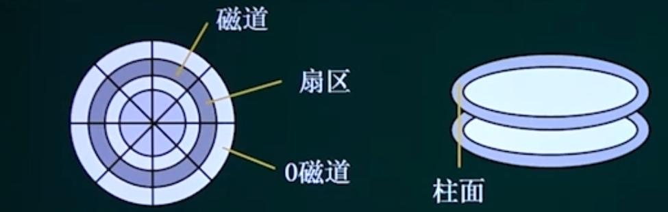

* 先来先服务（FCFS）
* 最短寻道时间优先（SSTF）
* 扫描算法（SCAN）
* 循环扫描算法（CSCAN）

读取磁盘数据的时间应包括以下三个部分：

* 找磁道的时间
* 找块（扇区）的时间，即旋转延迟时间
* 传输时间

计算非格式化容量

​	容量 = 面数  x （磁道数/面）x 内圆周长 x 最大位密度

计算格式化容量

​	容量 = 面数 x （磁道数/面）x （扇区数/道）x（字节数/扇区） 

> 磁盘调度时间计算例题：
>
> https://www.bilibili.com/video/BV1ch4y1V7sj/?p=3&spm_id_from=333.1007.top_right_bar_window_history.content.click&vd_source=89928f4f29ee22619e6cca9c6bc5635f

### 4. 文件管理

#### 4.1 文件组织结构

* 逻辑结构

  * 流式结构

  * 记录式文件

* 物理结构
  * 顺序结构
  * 链接结构
  * 索引结构

* 索引文件结构

​		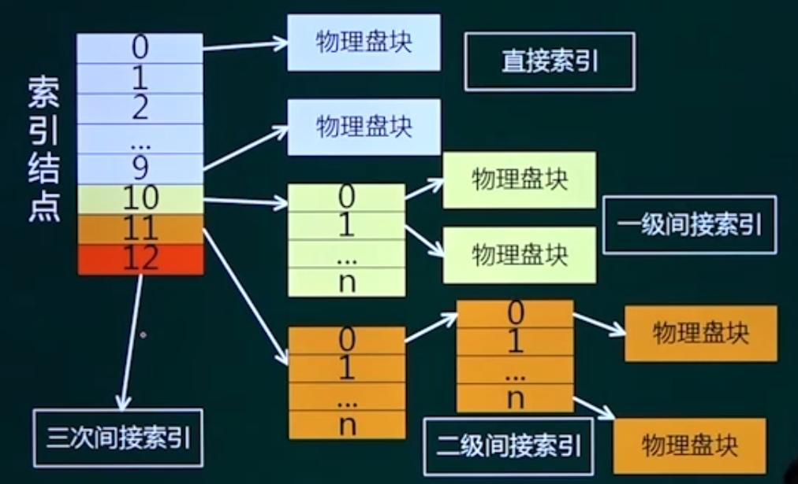

#### 4.2 树形目录结构

略

#### 4.3 空闲存储空间的管理

* 位示图法

### 5. 设备管理

* 虚设备与Spooling技术

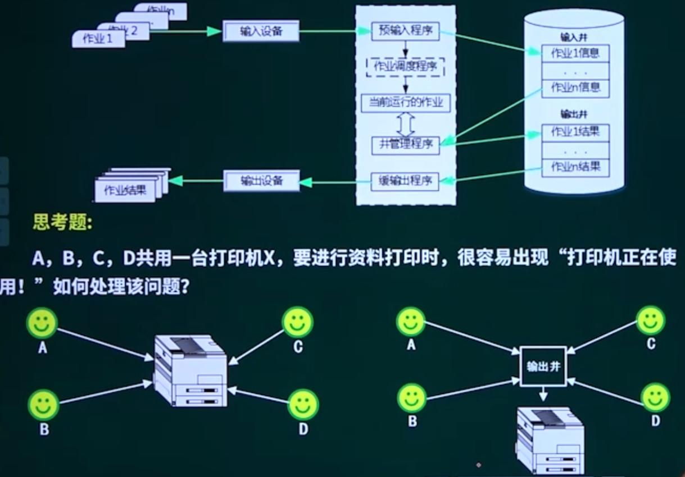

### 总结

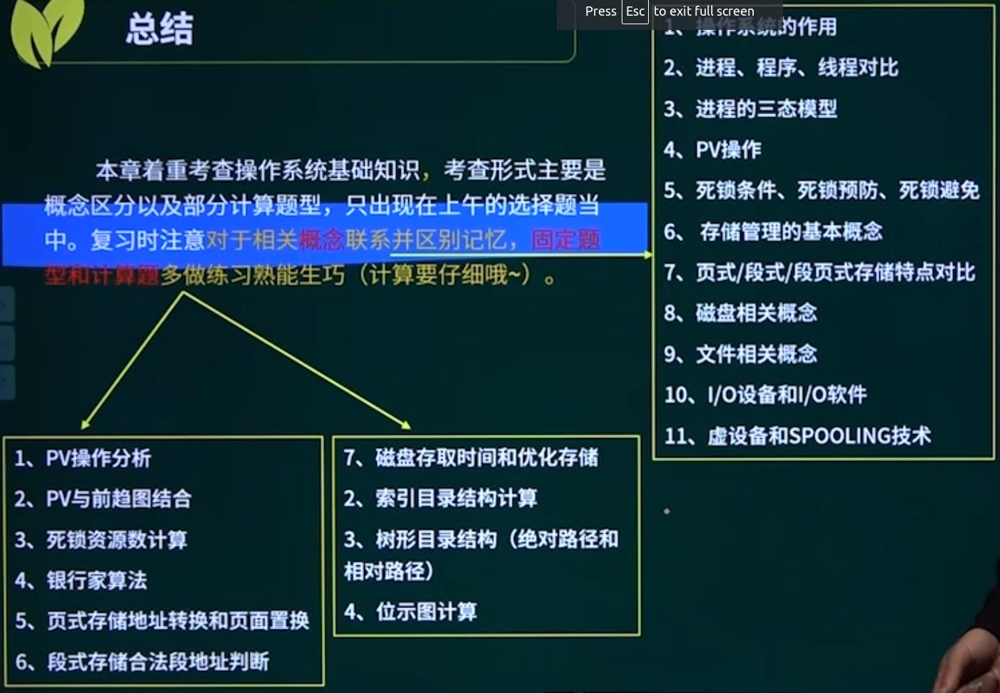
