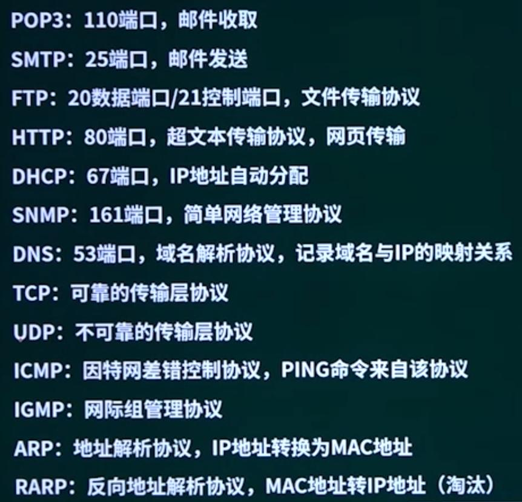

## 第4章 网络基础知识

### 1. OSI / RM

#### 1.1 OSI 7层网络模型

应用层数据称呼为报文，传输层为报文段。

在TCP/IP网络中，建立连接进行可靠通信是在==传输层==完成的。

在OSI/RM网络中，建立连接进行可靠通信是在==会话层==完成的。

#### 1.2 七层模型-数据在各层之间的传递过s程

5为应用层，4为传输层，3为网络层，2为数据链路层。

### 2. TCP/IP协议族

#### 2.1 各层的不同协议

* 应用层

> 要记住

基于TCP协议：

POP3/SMTP：邮件发接受与发送，POP3接受邮件，SMTP发送邮件。

FTP：文件传输协议

HTTP：超文本传输协议

Telnet：原程登陆协议

基于UDP协议：

DNS：域名解析协议

DHCP：动态主机路由选择协议

TFTP：短文传输协议

SNMP：简单网络管理协议

* 传输层协议

TCP：网络传输协议，可靠链接。

UDP：用户数据报，不可靠链接。

#### 2.2 按功能对协议分类

与网页访问相关：HTTP，HTTPS

与电子邮件相关：SMTP，POP3，IMAP4，MIME，PGP

远程访问/管理：TELNET，RAS

域名、IP地址解析相关：FTP

轻量目录访问协议：LDAP

#### 2.3 协议的传输过程

* 电子邮件协议

黄色实线表示首见建立的TCP网络连接。

* WWW协议 --- 万维网协议

URL：协议:// 主机地址[:端口号]/路径/文件名

浏览器：IE Firefox

协议：http，端口号80，https，端口号443，是以安全为目标的HTTP通道。

http 404 链接指向的网络不存在，即原始网页的URL失效。

* FTP协议

和其他协议不同的地方是这里需要建立两个链接，通过21端口建立命令链路，通过20端口建立数据链路。

* 其他协议
  * ARP：Address resolution protocal, 地址解析协议
  * ICMP：Internal control messages protocol，网络控制报文协议
  * IP：Internel Protocol，网际协议
  * TCP：Transfer Control Protocol，传输控制协议
  * UDP：User Datagram Protocol，用户数据包协议
* 协议端口

> 要记住端口号

### 3. IP地址与网络划分

#### 3.1 IP地址的组成

#### 3.2 IPV4

* IP地址

大型网络中，网络地址占1个字节，主机地址占3个字节，可以容纳的主机数为 $2^{24}$。

中型网络中，网络地址占2个字节，主机地址占2个字节，可以容纳的主机数为$2^{16}$。

小型网络中，网络地址占3个字节，主机地址占1个字节，可以容纳的主机数为$2^{8}$。

* IP地址掩码

  * 标准地址掩码

    A类：255.0.0.0

    B类：255.255.0.0

    C类：255.255.255.0

  * 地址掩码表示方法

    点分十进制

    位计数

#### 3.3 变长子网掩码

192.168.100.1/25：C类网络，这里25表示网络位为25位，借用主机位中的一位作为子网掩码，主机位变为7位。

主机位的数量计算：
$$
2^n-2
$$
其中n表示主机空间，-2表示减去全0和全1的两个不可用地址，==全0为子网号，全1为广播地址==。

#### 3.4 特殊含义的IP地址

#### 3.5 IPV6

12AB::CD30:0:0:0:0/60: 其中::表示0压缩，这里压缩了两个0，全部展开可以表示为 12AB:0:0:CD30:0:0:0:0/60

* IPV4与IPV6网络之间的通信技术

双协议栈、隧道技术、翻译技术

### 4. DNS和DHCP

DNS：域名解析协议

DHCP协议

1. 客户机/服务器模型
2. 租约默认为8天
3. 当租约过半时，客户机需要向DHCP服务器申请续租
4. 当租约超过87.5%时，如果仍然没有和当初提供IP的DHCP服务器联系上，则开始联系其他的DHCP服务器。
5. 固定分配、动态分配和自动分配

#### 4.1 DNS协议的查询过程

* 主机向本地域名服务器的查询采用==递归查询==。
* 本地域名服务器向根域名服务器的查询通常采用==迭代查询==。
* 递归查询：服务器必须回答目标IP与域名的映射关系
* 迭代查询：服务器收到一次迭代查询回复一次结果，这个结果不一定时目标IP与域名映射关系，也可以是其他DNS服务器的地址。
* 主机查询y.abc.com的IP地址时，会查询本地的host文件，然后查询自身缓存，如果都没有，才会递归查询本地域名服务器。

### 5. 网络规划与设计

### 6. 网络故障诊断

略