## 第5章 安全性基础知识

### 1. 计算机系统安全概述

#### 1.1 网络攻击

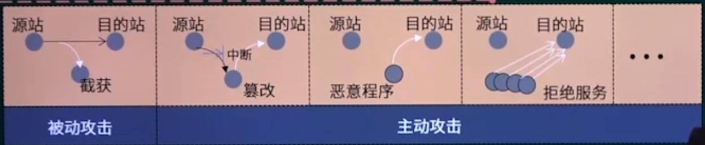

* 被动攻击：指攻击者从网络上窃听他人的通信内容，通常把这类攻击称为==截获==。
  * 流量分析：是通过持续检测现有网络中的流量变化或者变化趋势，从而得到相应信息的一种被动攻击方式。
* 主动攻击：指通过一系列方法，主动地获取向被攻击对象实施破坏的一种攻击方式。
  * 篡改：攻击者故意篡改网络上传送的报文，也包括彻底中断传送的报文。
  * 恶意程序：种类繁多，威胁较大的有：计算机病毒、计算机蠕虫、特洛伊木马、逻辑炸弹
  * 拒绝服务：指攻击者向因特网上的某个服务器不停地发送大量分组，使因特网或服务器无法提供正常服务。如：Dos，DDos。

#### 1.2 计算机网络安全内容

* 保密性：为用户提供安全可靠的保密通信是计算机网络安全最为重要的内容。
  * 网络的保密机制也是许多其他安全机制的基础，例如：访问控制中登陆口令的设计，以及数字签名的设计等。
* 安全协议的设计：主要是针对具体的攻击（如假冒）设计安全的通信协议
  * 一种是用形式化方法来证明，另一种是用经验来分析协议的安全性
* 访问控制：也叫做存取控制或者接入控制，必须对接入网络的权限加以控制，并规定每个用户的接入权限。

#### 1.3 两类密码体制

##### 1.3.1 对称密钥密码体制（对称加密算法）

所谓对称密钥密码体制，即==加密密钥和解密密钥是相同的密码体制==。

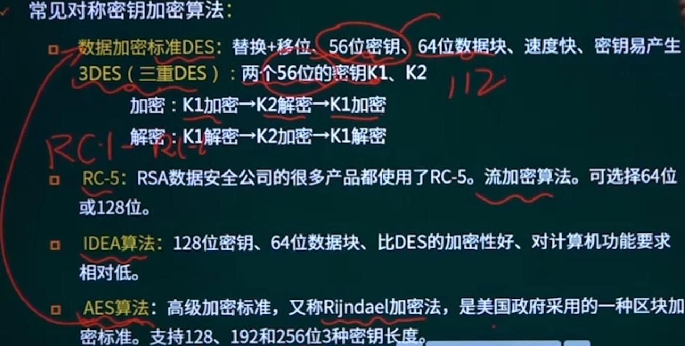

**DES**（Data Encryption Standard，数据加密标准），DES是对称的，也就是说它使用同一个密钥来加密和解密数据，属于==共享密钥加密算法==，同时DES也是一种分组加密算法，每次处理固定64位长度的数据块，其对数据块进行19次变换，其中16次变换由56位密钥的不同排列形式控制。。

**三重DES**：第一重和第三重采用相同的密钥，这要就是使用了 2x56 == 112位密钥。

缺陷：

1. 加密强度不高，但效率高
2. 密钥分发困难

##### 1.3.2 公钥密码体制（非对称加密算法）

##### 公开密钥加密算法：RSA

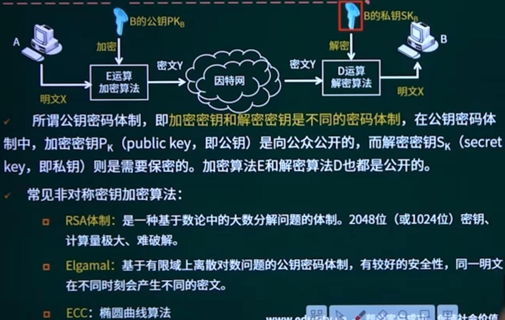

缺陷：

1. 加密速度慢

#### 1.4 RSA的加密和解密过程

* 参数定义和密钥生成
  * 选择两个大素数$p$和$q$；（保密）
  * 计算$n=p \times q$，$\phi(n)=(p-1)\times (q-1)$；（n公开，$\phi(n)$保密）
  * 选一整数e，满足 $1<e<\phi(n)$，且$gcd(\phi(n),e)=1$；（e公开）
  * 计算$d$，满足 $d\times e \equiv 1 mod\phi(n)$
* 公钥：$(n,e)$；私钥：$(n,d)$

* 加密算法：$c\equiv m^e mod\ n$
* 解密算法：$m \equiv c^dmod\ n$

> gcd():求最大公因数，$\equiv$:表示同余，mode表示取余。

例题：

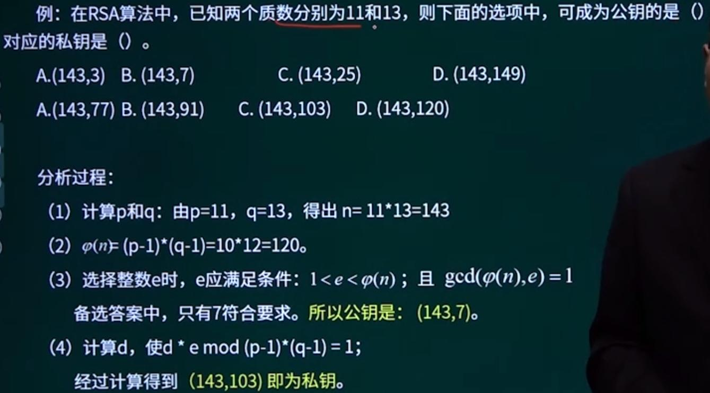

#### 1.5 数字签名与消息摘要

**认证------基本概念**

> 数字签名和消息摘要的作用

在网络的应用中，鉴别是网络安全中的一个很重要的问题，**认证和加密**并不相同，认证是要验证通信双方的确是自己所要通信的对象，而不是其他冒充者。

认证的分类：

* 实体认证，即时别通信对方的身份，防止假冒。==数字签名==
* 消息认证，即所收到的报文的确是报文的发送者所发送的，而不是其他人伪造的或篡改的。==报文摘要==

##### 1.5.1 数字签名的实现

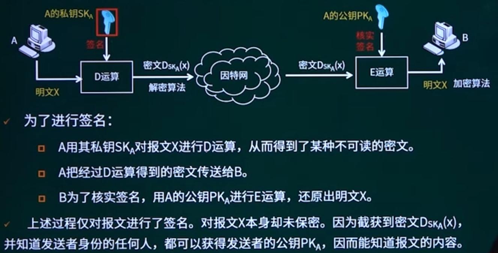

**具有保密性的数字签名**

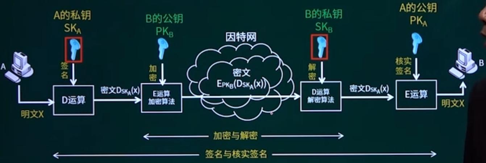

##### 1.5.2 消息摘要

对很长的报文进行数字签名会使计算机增加很大的负担（需要进行很长时间的运算），因此，我们传送不需要加密的报文时，应当使接受者能用很简单的方法鉴别报文的真伪。

* 报文摘要（消息摘要）是进行报文认证的简单方法。
* 常用的算法有==MD5（消息摘要算法）==，==SHA（安全散列算法）==等，市场上广泛使用的MD5，SHA算法的散列值分别为==128==和==160==位，由于SHA通常采用的密钥长度较长，因此安全性高于MD5，但计算要慢。

**消息摘要算法**

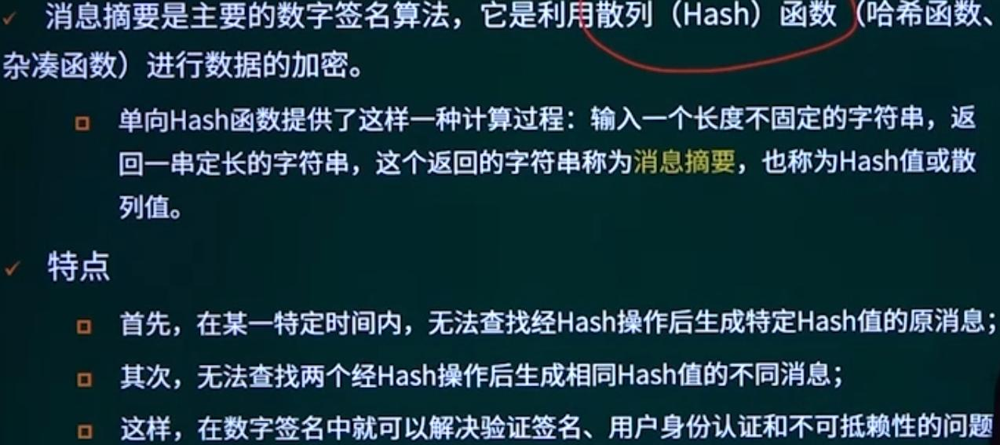

**消息摘要的实现**

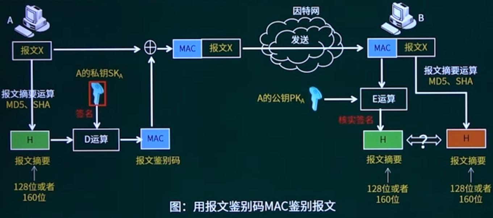

这里通过报文摘要算法生成了报文摘要H，对报文本身没有加密，通过对报文摘要H加密，B再解密报文摘要，比对报文摘要一致性从而判断报文本身有没有被修改。

优先：仅对短得多的定长报文摘要H进行数字签名要比对整个报文进行数字签名要简单得多，所耗费的计算资源也小得多。

##### 1.5.3 数字信封

对原文信息采用对称密钥K进行加密，再利用非对称密钥加密传递对称密钥。

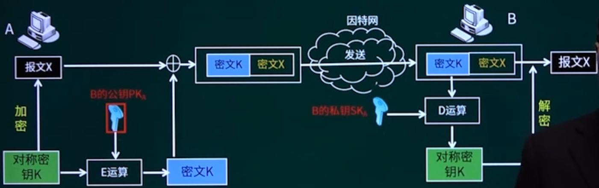

#### 1.6 综合例题

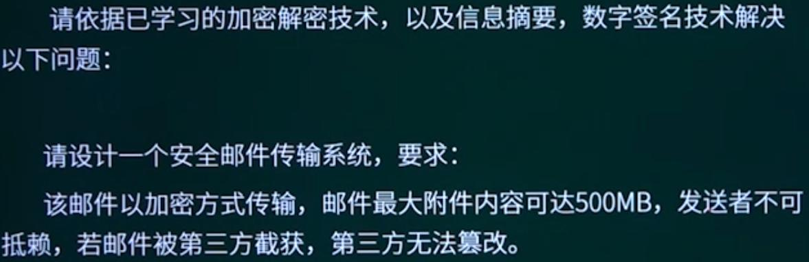

解题思路：

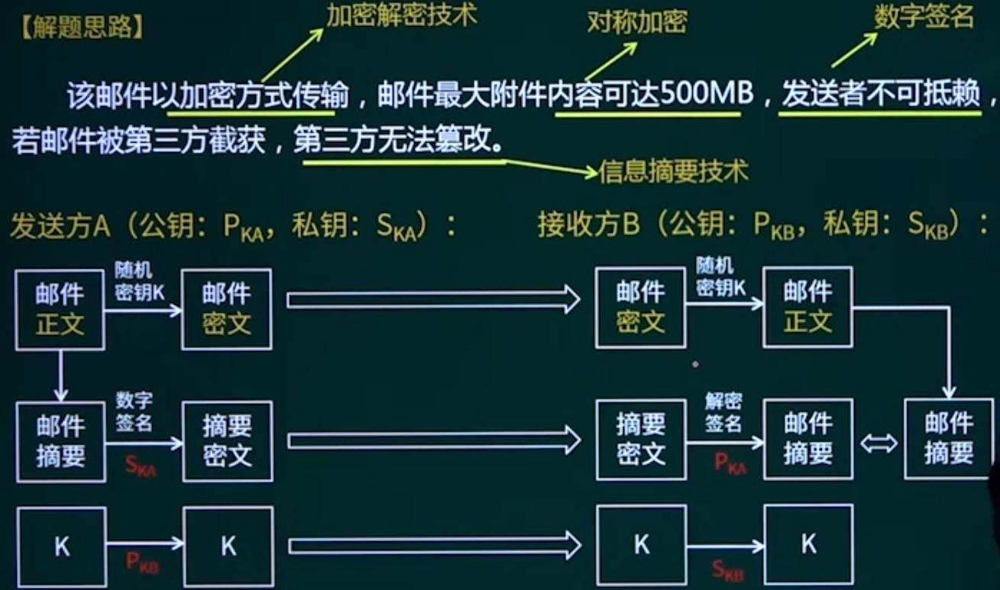

### 2. 信息安全基础

#### 2.1 PKI（Public Key Infrastructure）公钥基础设施

* CA（证书颁发机构）
* 数字证书
* 证书实现的安全保证
  * 机密性
  * 不可否认性
  * 完整性
  * 鉴别

数字证书的格式遵顼X.509国际标准，主要内容包括：

* 版本号
* 序列号
* 签名算法
* 发行者
* 有效期
* 主体名
* ==公钥：有效期的公钥及其使用方法==
* 发行者ID
* 主题ID
* 扩展域
* ==认证机构的签名：用CA私钥对证书的签名==

#### 2.2 数字证书的应用过程

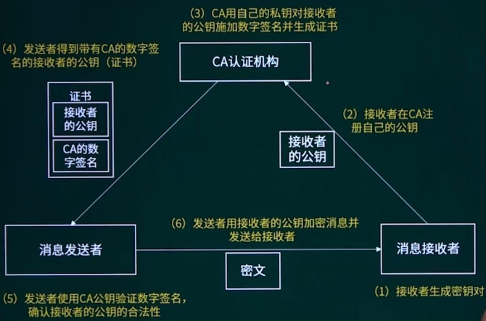

#### 2.3 防火墙技术

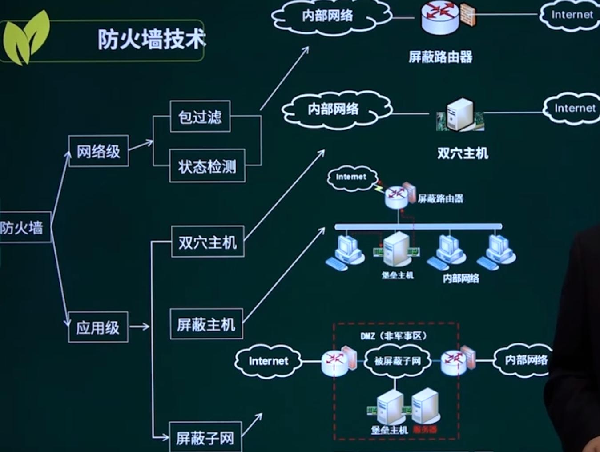

防火墙是位于两个网络之间的屏障，一边是内部网络（可信赖的网络），另一边是外部网络（不可信赖的网络），按照系统管理员预先定义好的规则控制数据包的进出。

防火墙最重要的特性就是利用设置的条件，监测通过包的特征来决定放行或组织数据，防火墙一般架设在提供某些服务的服务器前，具有网关功能，用户对服务器或内部网络的访问请求与反馈都需要经过防火墙的转发，相对外部用户而言，防火影藏了内部网络结构。

防火墙作为一种网络安全设备，安装有网络操作系统，可以对流经防火墙的流量进行详细的日志和审计，**但不能提供漏洞扫描功能**。

#### 2.4 计算机病毒

* 定义：破坏计算机功能或者破坏数据，影响计算机使用并且能够自我复制的一组计算机指令或者程序代码。

* 注意区分病毒和木马：病毒会直接破坏计算机数据，木马则会潜伏下来，无外在表现，悄悄建立网络链接。

* 计算机病毒特点：传播性、隐蔽性、感染性、潜伏性、触发性、破坏性。

### 3. 网络安全协议

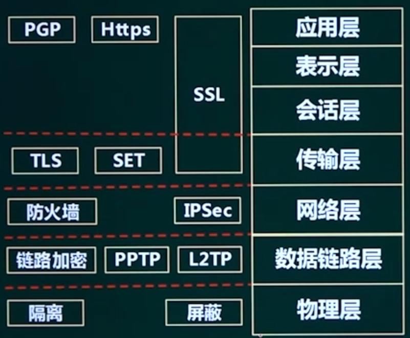

隔离：有线

屏蔽：无线

Https == http + ssl

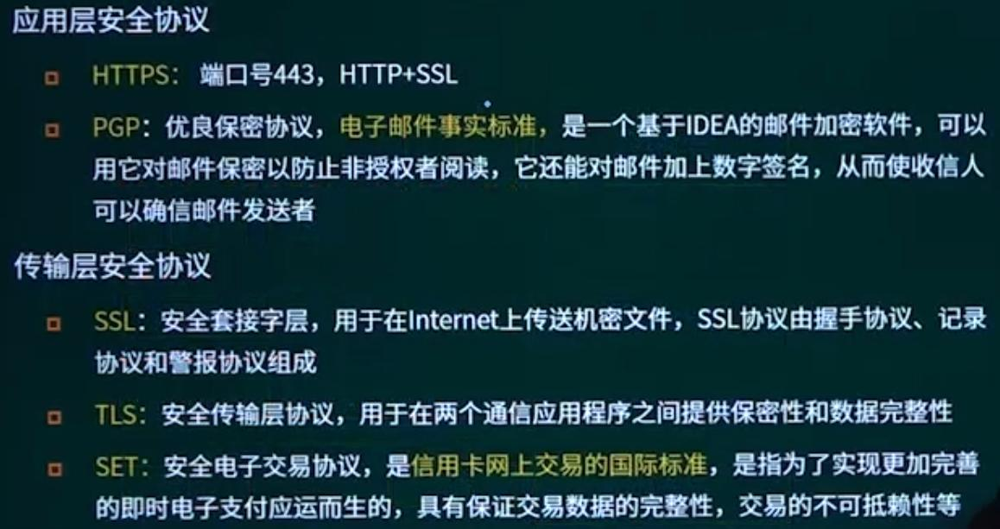

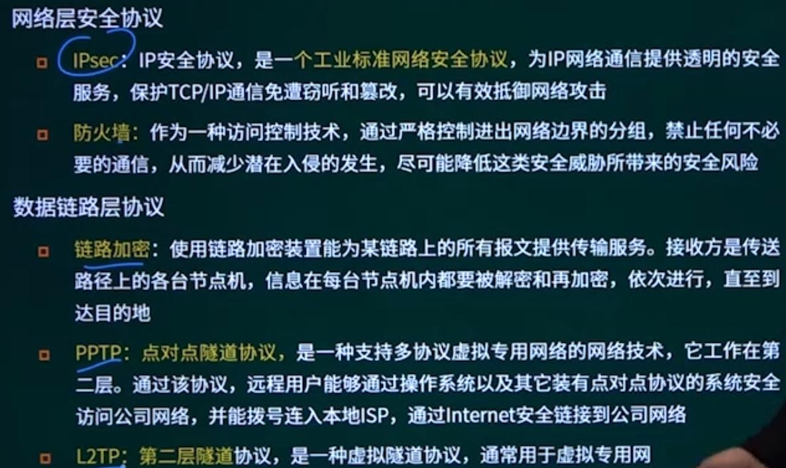

### 4. 入侵检测技术

入侵检测技术包括专家系统、模型检测、简单匹配。漏洞扫描不是入侵检测技术。
