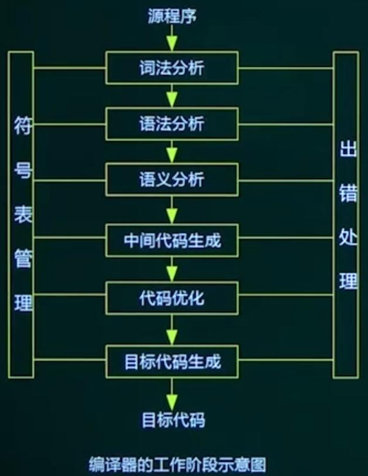
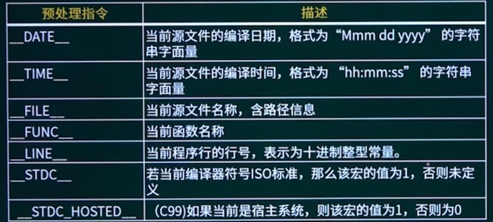
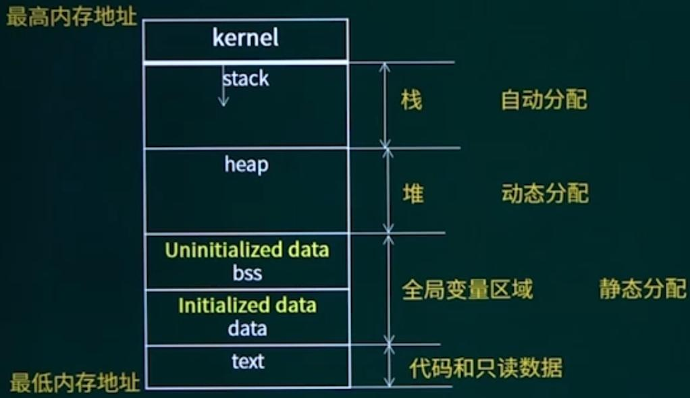

## 第6章 嵌入式软件程序设计

### 1. 嵌入式系统开发与设计

#### 1.1 嵌入式应用开发的过程

硬件设计和软件设计相结合。

* 硬件的设计与实现
* 设备驱动软件的设计与实现
* 嵌入式操作系统的选择、移植，以及API接口函数的设计
* 支撑软件的设计与调试
* 应用程序的设计与调试
* 系统联调，样机交付

#### 1.2 嵌入式应用开发的特点

* 需要交叉编译工具
* 通过仿真手段进行调试
* 开发板是中间目标机
* 可利用资源有限
* 需要与硬件打交道

#### 1.3 开发模式三种：

* 本机开发
* 交叉开发
* 模拟开发

#### 1.4 嵌入式软件开发流程

* 嵌入式平台选型：硬件和软件平台选型
* 软件设计：功能划分，哪些由硬件实现，哪些由软件实现
* 特性设计：可靠性，实时性等
* 编码
* 测试
* 下载和运行

### 2. 嵌入式程序设计

#### 2.1 表达式

* 前缀表达式（+ a b）

* 中缀表达式（a + b）
* 后缀表达式（a b +），也称为逆波兰式

程序中用栈保存表达式，一般考表达式的转换。

#### 2.2 程序的编译过程

编译程序：也称编译器，生成目标语言程序。

解释程序：也称解释器，生成源代码或者中间代码。

根本区别在于是否生成独立的目标程序。

* 编译器的工作阶段

词法错误：非法字符、关键字或标识符拼写错误。

语法错误：语法结构出错，if ... end if不匹配，缺分号等。

语义错误：死循环，零除数，其他逻辑错误等。

* 解释程序的基本原理

另一种语言处理程序，在词法、语法和语义分析方面与编译程序的工作原理基本相同。但在运行用户程序时，它直接执行源程序或源程序的内部形式。因此，解释程序与编译程序最大的区别就是不产生源程序的目标程序。

可以将解释程序分为两个部分：

1. 分析部分，包括通常的词法分析、语法分析和语义分析程序，经分析后把源程序翻译为中间代码。
2. 解释部分，用来对第一部分所产生的中间代码进行解释执行。

#### 2.3 面向过程的语言

* c语言预定义宏

* 存储管理

一个程序运行时的内存分布：

* 面向对象
  * 多态：基类指针可以调用派生类方法
  * 重载：函数名相同，函数形参或者返回类型不同。
  * 覆盖：派生类替换基类的成员函数。

> c++三大特性：封装、多态、继承

