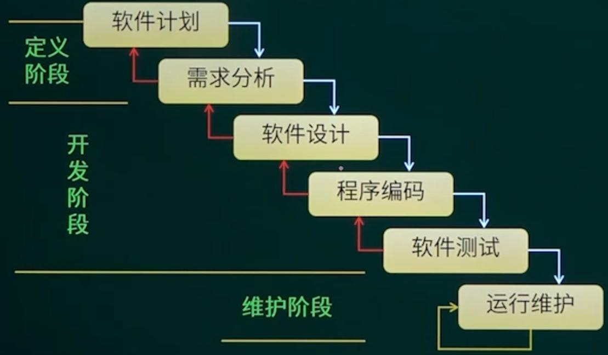
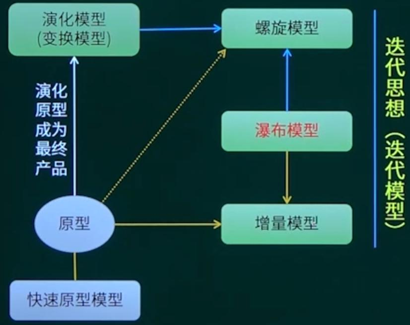

## 第7章 嵌入式系统开发与维护知识

### 1. 系统开发过程及项目管理

#### 1.1 开发模型

| 瀑布模型（SDLC）         | 演化模型              | 增量模型                                |
| ------------------------ | --------------------- | --------------------------------------- |
| **螺旋模型**             | **快速原型模型**      | 喷泉模型                                |
| V模型                    | 迭代模型/迭代开发方法 | 构件组装模型/基于构件的开发方法（CBSD） |
| 统一过程/统一开发方法    | **敏捷开发方法**      | **模型驱动的开发方法**                  |
| **软硬件协同的开发方法** |                       |                                         |

* 开发模型---瀑布模型

适用二次开发，需求明确的开发流程。

* 开发模型---其他经典模型

**演化模型**：在原型（可能仅为一个界面，不具有可操作性）的基础上，通过与用户沟通，反复修改，最终定型产品的研发流程。

**螺旋模型**：结合了演化模型和瀑布模型，针对用户参与过程，反反复复修改原型的情况。右图为螺旋模型，左图为增量模型。

**V模型**：重视测试，适合代码质量要求比较高的项目。

SDLC（瀑布模型）结合CBSD（构件组装模型）得到RAD（快速应用开发模型）

**构建组装模型**

**敏捷开发方法**

1. 水晶方法系列（Crystal）：其目的是发展一种提倡“机动性的”方法，包含具有共性的核心元素，每个都含有独特的角色、过程模型、工作产品和实践。Crystal家族实际上是一组经过证明、对不同类型项目非常有效的敏捷过程，它的发明使得敏捷团队可以根据其项目和环境选择最合适的Crystal家族成员。
2. 与极限编程XP对比
   * 它和XP方法一样，都有以人为中心的理念，但在实践上有所不同。Crystal考虑到人们一般很难严格遵循一个纪律约束很强的过程，因此，与XP的高度纪律性不同，Crystal探索了==用最少纪律约束而仍能成功的方法==。从而在产出效率与易于运作上达到一种平衡。
   * 也就是说，虽然水晶系列不如极限编程那样的产出效率，但会有更多的人能够接受并遵循它。

3. 开放式源码：指的是开放源码届所用的一种运行方式。
   * 开放式源码项目有一个特别之处，就是==程序开发人员在地域上分布很广==，这使得它和其他敏捷方法不同，因为一般的敏捷方法都强调项目组成员在同一个地点工作。
   * 开发源码的一个特处特点是==查错排障的高度并行性==，任何人发现了错误都可以将改正源码的“补丁”文件发给维护者，然后由维护者将这些“补丁”或是新增的代码并入源码库。

4. 并列争球法（Scrum）：该方法强调了一个事实，即==明确定义了可重复的方法过程==，只限于在明确定义了可重复的环境中，为明确定义了的可重复的人员所用，区=去解决明确定义了的可重复问题。其运用了“迭代”的方法，把每段时间（如30天）一次的迭代称为一个==冲刺==，并按需求的优先级来实现产品，有多个自治组织和自治小组并行的递增来实现产品。

   与极限编程的区别：

   * 迭代长度的不同，极限编程更短。
   * 在迭代中，是否允许修改需求，极限编程允许，并列争球法不允许。
   * 在迭代中，User Story(这里指用户功能)是否严格按照优先级别来实现，极限编程是，Scrum不是。
   * 软件在实施过程中，是否采用严格的工程方法，保证进度或者质量，极限编程是，Scrum不是。

5. Coad的功用驱动开发方法（FDD-Feature Driven Development）,由Jeff De Luca和Peter Coad提出
   * 和其他敏捷方法一样，致力于短时的迭代阶段和可见可用的功能。
   * 在FDD中，一个迭代周期一般是两周
   * 在FDD中，编程开发人员分成两类：==首席程序员==和“类”程序员。首席程序员是最富有经验的开发人员，他们是项目的协调者、设计者和指导者，而类程序员负责源码的编写工作。
6. 自适应软件开发方法（ASD方法）：Adaptive Software Development方法，其核心是三个非线性的、重叠的开发阶段：==猜测、合作和学习==。
7. 动态系统开发方法（DSDM）：也称为业务中心框架开发方法，它倡导以业务为核心，快速有效的进行系统开发，可以将DSDM看成是一种控制框架，重点在于快速交付、并补充如何应用这些控制的指导原则的框架。

#### 1.2 项目管理

##### 1.2.1 时间管理

* 项目计划评审技术

1. **关键路径法**：是在制定进度计划时使用的一种进度网络分析技术，关键路径法沿着项目进度网络路线进行正向和反向分析，从而计算出所有计划活动理论上最早开始与完成日期、最迟开始与完成日期，不考虑任何资源限制。

   总时差（松弛时间）：==在不延误宗工期的前提下，该活动的机动时间==。活动的总时差等于该活动最迟完成时间与最早完成时间之差，或该活动最迟开始时间与最早开始时间之差。 

   **总时差为0的路径为关键路径。**

2. **甘特图**

细线表示计算时间，粗线表示实际消耗时间。

* 优点：甘特图直观、简单、容易制作，便于理解，能很清晰地标识出每一项任务的起始与结束时间，一般适用比较简单的小型项目，可用于WBS的任何层次、进度控制、资源优化、编制资源和费用计划。
* 缺点：不能系统地表达一个项目所包含的各项工作之间的负责关系，难以进行定量计算和分析，以及计划的优化等。

**项目管理固定考察题型：**

==正反向分析求关键路径。==

分析方法：

法一：最短路径法

法二：暴力法：从图上暴力遍历找到工期最长的路径，即为关键路径。==优先选择当前方法==

答案：B，C

##### 1.2.2 软件配置管理

IEEE对配置项的定义为硬件、软件或二者兼有的集合，为配置管理指定的，在配置管理过程中作为一个单独的实体对待，可作为配置项管理的有：外部交付的软件产品和数据、指定的内部软件工作产品和数据、指定的用于创建或支持软件产品的支持工具、供方/供应商提供的软件和客户提供的设备/软件。

* 典型配置项包括==项目计划书、需求文档、设计文档、源代码、可执行代码、测试用例、运行软件所需的各种数据，==他们经评审和检查通过后进入软件配置管理（SVM）

* 每个配置项的主要属性有：==名称、标识符、文件状态、版本、作者和日期等。==所有配置项都被保存在配置库里，确保不会混淆、丢失。
* 配置项及其历史记录反映了软件的演化过程。

**检查点**：指在规定时间间隔内对项目进行检查，比较实际与计划之间的差异，并根据差异进行调整。

**里程碑**：完成阶段性工作的标志，不同类型的项目里程碑不同。

**基线**：指一个（或一组）配置项在项目生命周期的不同时间点上通过正式评审而进入正式受控的一种状态。基线是一些重要的里程碑，但相关交付成果要通过正式评审，并作为后续工作的基准和出发点。基线一旦建立后变化需要受控制。

* 功能基线（定义基线）：指在系统分析与软件定义阶段结束的时候经过正式评审和批准的系统设计规格说明书，（最早）。
* 分配基线（需求基线）：也叫指派基线，是指软件需求分析阶段结束时，经过正式评审和批准的软件需求规格说明书（SRS）（次之）。
* 产品基线：指在软件组装与系统测试阶段结束时，经过正式评审和批准的有关开发的软件产品的全部配置项的规格说明，（最后）。

**变更控制**：按照变更控制系统来管理变更，所谓变更管理的控制系统它时一套实现所确定的修改项目文件或者改变项目活动时候应该遵循的程序。

**版本控制**：

**项目风险**：

#### 1.3 软件过程改进

> 考一道选择题

==CMM即软件能力成熟度模型==，是目前国际上最流行、最实用的软件生产过程标准和软件企业成熟度的等级认证标准。规定了软件研制和软件测试中的主要软件管理过程和工程过程的实践，主要用于评价软件企业的质量保证能力。

* 可重复级：项目级别

* 已定义级：组织级别

* 已管理级：量化级别

* 优化级：缺陷预防级别

### 2. 系统分析基础知识

#### 2.1 需求工程概述

软件的需求工程：包括了创建和维护需求文档所必须的一切活动的过程。

#### 2.2 需求分类

软件需求指的是用户对系统在功能、行为、性能、设计约束等方面的期望。

软件需求分类：

* 业务需求（整体全局）
* 用户需求（用户视角）
* 系统需求（计算机化）
  * 功能需求
  * 非功能需求
  * 设计约束

#### 2.3 需求分析

##### 2.3.1 结构化分析方法

从上图可以看出，结构化分析方法可以分为三种模型：数据流图模型DFD，状态转换图模型STD和数据模型ER图，数据字典对模型中的数据进行描述，类似于元数据。

##### 2.3.2 面向对象分析(OOA) - UML语言

> 考得非常少，非重点

### 3. 系统设计知识

#### 3.1 结构化设计

结构化设计分为概要设计和详细设计，主要遵循以下几个原则：

* 抽象化
* 自顶而下、逐步求精
* 信息隐蔽
* 模块独立（高内聚、低耦合）

##### 3.1.1 设计模块的几大基本原则

* 保持模块大小适中
* 尽可能减少调用的深度
* 多扇入，少扇出
* 单入口，单出口
* 模块的作用域应该在模块之内：少用全局变量，多用局部变量。
* 功能应该是可预测的

> 扇入指一个模块对另一个模块的调用，扇出指当前模块调用其他模块。

##### 3.1.2 内聚和耦合的分类

> ==常考点==

* 内聚

* 耦合

##### 3.3 模块结构设计

模块结构设计的基本任务是：将系统划分为模块、确定软件的结构，模块的功能和模块之间的接口，以及全局数据结构的设计

* 模块的概念
  * 模块是组成系统的基本单位，它的特点是可以组合、分解和更换
* 模块的四要素
  * 输入和输出
  * 处理功能：指模块把输入转换成输出所做的工作
  * 内部数据：指仅供该模块本身引用的数据
  * 程序代码：指用来实现模块功能的程序

#### 3.2 面向对象设计

#### 3.3 软硬件协同设计

### 4. 下午题训练

略
