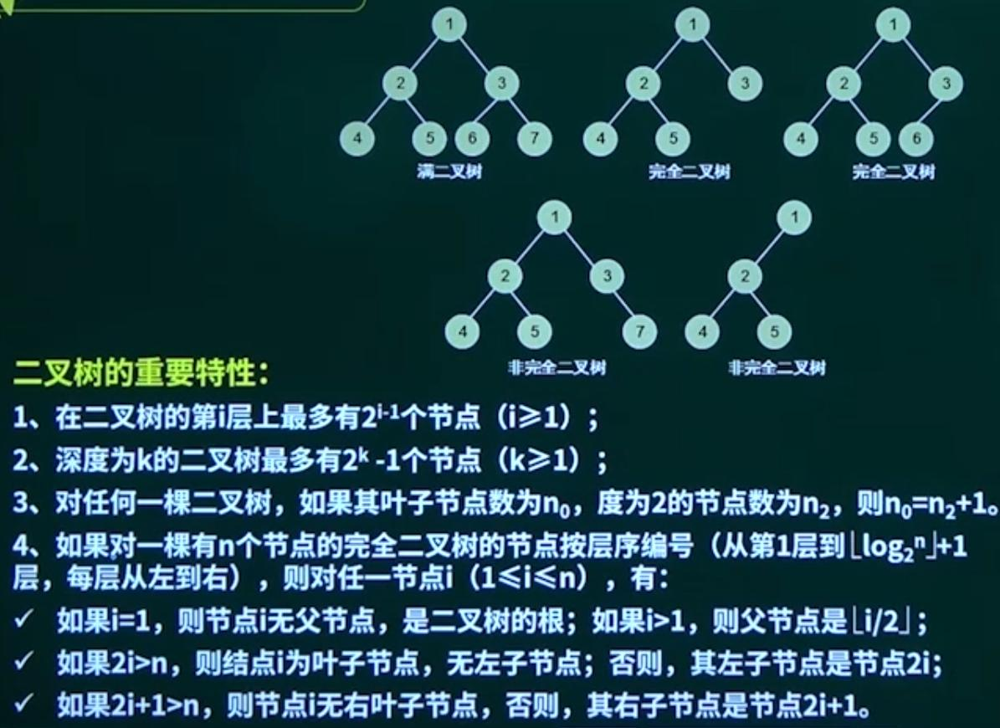
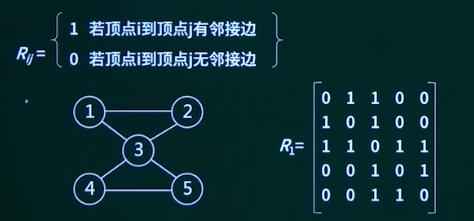
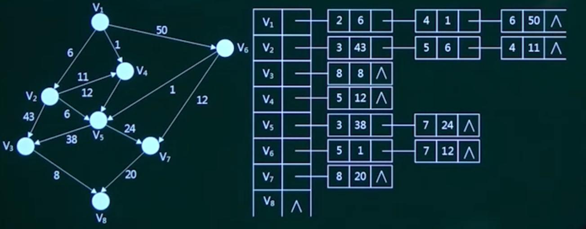
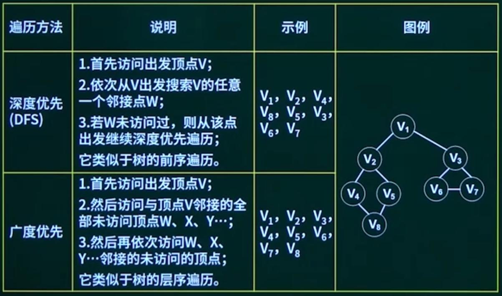
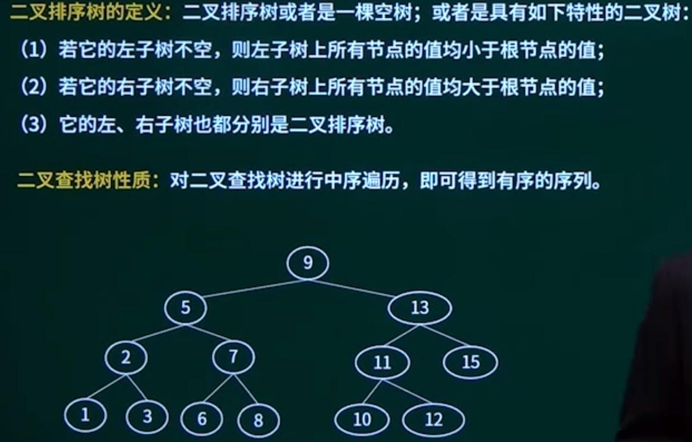
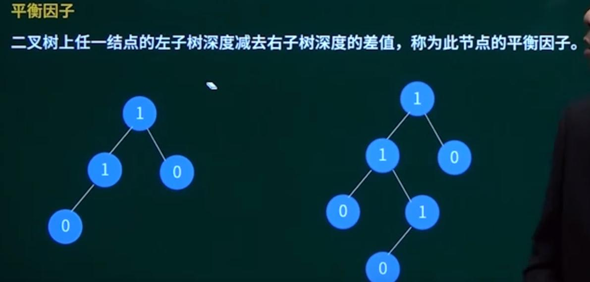
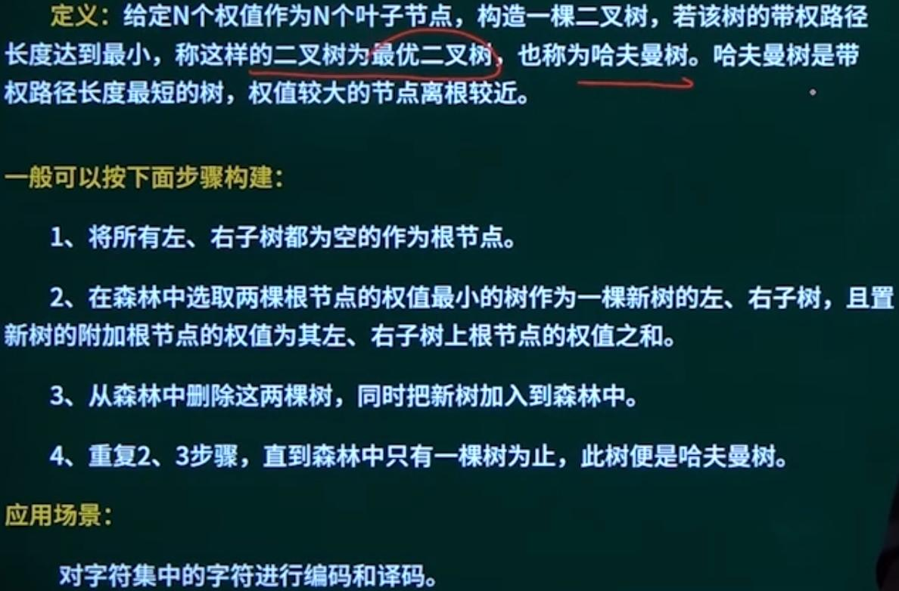
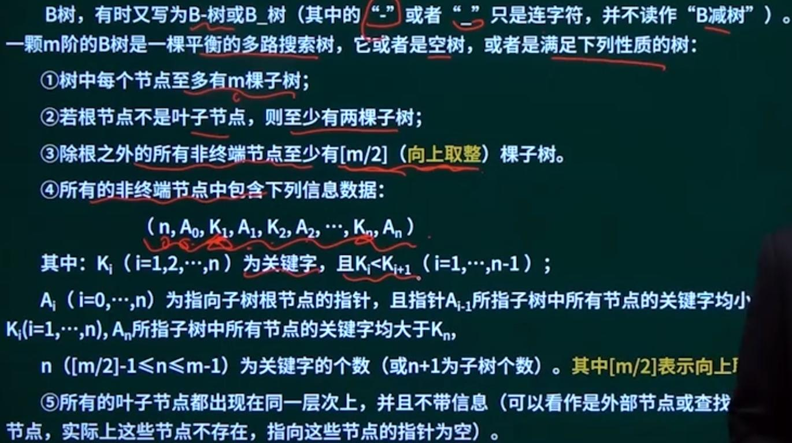
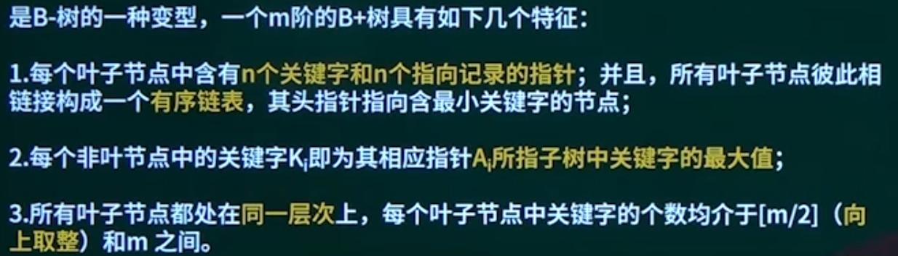
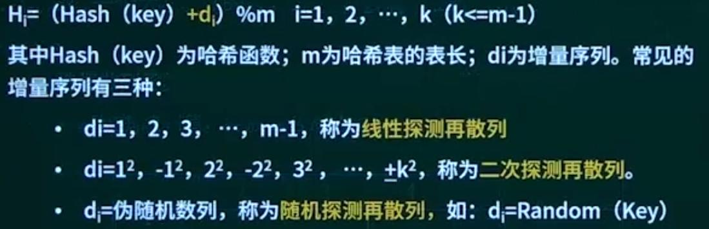

## 第9章 数据结构与算法

### 1. 数据结构与算法概念

算法的5个重要特性：

* 有穷形：执行有穷步之后结束，且每一步都可在有穷时间内完成
* 确定性：算法每一条指令都必须有确定的含义
* 输入：有一个或多个输出
* 输出：有一个或多个输出
* 有效性：算法每个步骤都能有效执行并在执行有限次数后能得到确定结果。

算法可以用伪代码描述，介于自然语法与编程语言之间，不拘泥于具体实现。

### 2. 线性表

* 顺序存储结构：顺序表
* 链式存储结构：链表
* 队列和栈：==内存不一定连续==

#### 2.1 链表的基本操作

* 单链表删除结点：将当前结点指针指向下下一个结点即可。
* 单链表插入结点：将当前结点指针value暂存为ptr1，指针value值指向待插入结点，待插入结点指针赋值为ptr1。
* 双向链表删除结点
* 双向链表插入结点

#### 2.2 广义表

广义表是n个表元素组成的有限序列，是线性表的推广，通常用递归的形式进行定义，记作：$LS=(a_0,a_1,...,a_n)$。

注：其中LS是表名，$a_i$是表元素，它可以是表（称为子表），也可以是数据元素（称为原子）。其中n是广义表的长度（==也就是最外层包含的元素个数==），n=0的广义表为空表；而递归定义的重数就是广义表的深度，就是定义中所包含括号的重数，原子的深度为0，空表的深度为1。

#### 2.3 串

串是仅由字符构成的有限序列，是取值范围受限的线性表。

### 3. 数组与矩阵

二维数组$a[m][n]$：

$a[i][j]$的存储地址（按行存储）为：$a+(i*n+j)*len$ 

$a[i][j]$的存储地址（按列存储）为：$a+(j*m+i)*len$

### 4. 树与二叉树

* 节点的度：当前节点的子节点数
* 树的高度：树的最大层数，根节点层数为1
* 叶子节点：子节点数为0的节点为叶子节点
* 内部节点
* 父节点
* 子节点
* 兄弟节点
* 层次

#### 4.1 二叉树

##### 4.1.1 二叉树的遍历

* 前序遍历：根、左、右
* 中序遍历：左、根、右
* 后序遍历：左、右、根
* 层次遍历

#### 4.2 堆

堆是计算机科学中一类特殊的数据结构的统称，堆通常是一个可以被看做一棵==完全二叉树==的数组对象。

若n个元素的序列$\{a_1 a_2 ... a_n\}$满足$a_i \leqslant a_{2i}$且$a_i \leqslant a_{2i+1}$称为小根堆，满足$a_i \geq a_{2i}$且$a_i \geq a_{2i+1}$称为大根堆。

从堆的定义可以看出，堆实质是满足如下性质的完全二叉树：

* 二叉树中任一非叶子结点均小于（大于）它的孩子结点
* 堆总是一棵完全二叉树

### 5. 图

#### 5.1 图的存储

==邻接矩阵表示法==：用一个n阶方阵R来存放图中各结点的关联信息，其矩阵元素$R_{ij}$定义为：

==邻接链表表示法==：首先把每个定点的邻接顶点用链表示出来，然后用一个一维数组来顺序存储上面每个链表的头指针。

有向图：

#### 5.2 图的遍历

### 6. 查找

五大查找

* 顺序表查找

  * 顺序查找
  * 二分查找
  * 索引顺序查找

* 树表查找

  * 二叉排序树

  

  二叉查找树（排序）：二叉查找树是先对待查找的数据进行生成树，确保树的左分支的值小于右分支的值，然后再去和每个节点的父节点比较大小，查找最适合的范围。

  * 二叉平衡树：本质是二叉排序树

    > 和完全二叉树（不一定有序）没有相互包含关系

    又称为AVL树，或者是一颗空树，或者是具有下列性质的二叉树：他的左子树或右子树都是==平衡二叉树==，且左子树和右子树的深度之差的绝对值不超过1。

    

    如图，左图为平衡二叉树，右图不为平衡二叉树。

  * 哈夫曼树【不懂】

  

  * B树

  

  * B+树
  
  

* 散列表查找

  散列表构造的基本思想：已知关键字集合U，最大关键字为m，设计一个函数Hash，它以关键字为自变量，关键字的存储地址为因变量，将关键字映射到一个有限、地址连续的区间T[0,...,n-1]（n<<m）中，这个区间就称为散列表，散列查找中使用转换函数称为散列函数。

  当散列函数出现散列冲突时，指的是不同自变量，因变量相同，解决冲突的方法有：

  * 链地址法（拉链法）
  * 开放定址法

  

  * 哈希查找
